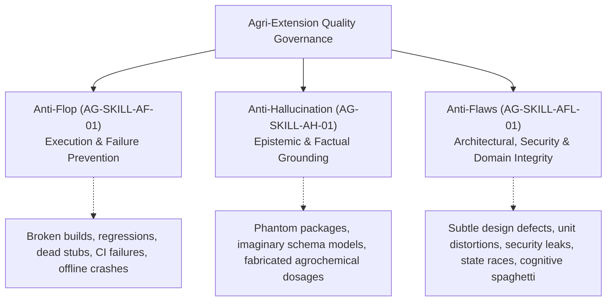

# Anti-Flaws Protocol (AG-SKILL-AFL-01)

This protocol establishes the architectural, structural, agronomic, security, and algorithmic standards for the **Agri-Extension Decision Support Platform**. It is strictly organized into dedicated, comprehensive sections for **Frontend** and **Backend** engineering disciplines, alongside cross-cutting shared standards.

---

## 1. The Quality Hierarchy: Flop vs. Hallucination vs. Flaw

Engineering quality on this platform is governed by three complementary pillars:



* **Flop ([`anti_flop.md`](file:///home/psalmprax/ALL_PROJECTS/ag_extension_decision_support/anti_flop.md))**: A direct execution failure—broken builds, failing unit tests, dead stubs, unhandled runtime crashes, or regression breaches.
* **Hallucination ([`anti_hullicination.md`](file:///home/psalmprax/ALL_PROJECTS/ag_extension_decision_support/anti_hullicination.md))**: An epistemic untruth—claiming code works without testing, referencing non-existent npm modules, or inventing agrochemical formulations.
* **Flaw (This Protocol)**: An **insidious design defect, architectural anti-pattern, security blindspot, unit distortion, state race condition, or cognitive complexity trap** that compiles cleanly and passes basic happy-path tests, but causes production failures, data leakage, crop poisoning, or systemic unmaintainability under real field conditions.

---

## 2. Frontend Anti-Flaws Protocol

The frontend client applications (React Dashboard, Progressive Web App / PWA, and WebExtension) operate on low-power mobile devices under erratic connectivity in rural farming hubs. The following standards prevent frontend flaws:

### 2.1 React State & Asynchronous Turn Hygiene
Modern interactive interfaces—such as the multilingual voice copilot in [`TalkingAssistant.tsx`](file:///home/psalmprax/ALL_PROJECTS/ag_extension_decision_support/ag-extension-dashboard/src/frontend/src/pages/landing/sections/TalkingAssistant.tsx)—coordinate multiple asynchronous event streams (Speech-to-Text, LLM inference, Audio playback, Audio visualizers).

1. **Elimination of Stale Closure Traps**:
   * Never reference closed-over React state variables across asynchronous event callbacks (`setTimeout`, `Promise`, WebSocket listeners) when state updates might occur while the callback is in flight.
   * Pass runtime arguments explicitly through event pipelines or bridge through mutable `useRef` handles:
     ```typescript
     // ❌ FLAWED: selectedLanguage is stale when prompt chip is clicked
     const handleSelectPrompt = (item: SampleQuestion) => {
       setSelectedLanguage(item.lang);
       handleSendMessage(item.text); // BUG: handleSendMessage closes over old selectedLanguage!
     };

     // ✅ FLAWLESS: Parameter override guarantees immediate runtime validity
     const handleSelectPrompt = (item: SampleQuestion) => {
       setSelectedLanguage(item.lang);
       handleSendMessage(item.text, item.lang);
     };
     ```
2. **Functional State Updates for Collections**:
   * Always use functional state updaters `setItems(prev => [...prev, newItem])` when appending messages, consultation logs, or cache entries to avoid dropping parallel updates.
3. **Double-Submit Prevention & Loading Locks**:
   * All user mutation triggers (sending messages, saving field records, submitting forms) must disable inputs and buttons during pending network requests (`disabled={isLoading || isTranscribing}`).

### 2.2 Component Decomposition & Fast-Refresh Compliance
1. **The 300-Line Component Upper Bound**:
   * No single UI component file should exceed 300 lines of code. If a component grows beyond this limit, extract presentational child components, custom hooks, and utility modules.
   * Example: In [`TalkingAssistant.tsx`](file:///home/psalmprax/ALL_PROJECTS/ag_extension_decision_support/ag-extension-dashboard/src/frontend/src/pages/landing/sections/TalkingAssistant.tsx), logic is decomposed into `VoiceOrb`, `Waveform`, `PersonaSelector`, `LanguageSelector`, `ActiveContextBanner`, `HandoffCard`, `ChatMessage`, `ChatInputForm`, and the `useSpeechController` hook.
2. **Vite Fast-Refresh Compliance (`react-refresh/only-export-components`)**:
   * Files that declare React components must ONLY export React components or type definitions (`export type ...`).
   * Never export helper functions, mutable variables, or non-component constants from component files; place them in dedicated utility files or keep them internal.

### 2.3 Web Speech, MediaStream & Web Audio Lifecycle
Voice AI features interact directly with browser hardware (Microphone, AudioContext, SpeechSynthesis). Improper teardown causes memory leaks, battery drain, and browser crashes.

1. **Deterministic Hardware Teardown**:
   * Every active `MediaStream` must stop all tracks upon unmount or recording stop:
     ```typescript
     stream.getTracks().forEach((track) => track.stop());
     ```
   * Every `AudioContext` must be explicitly closed (`await audioCtx.close()`).
   * `SpeechSynthesis` must be canceled (`speechSynthesis.cancel()`) before initiating new speech playback or unmounting.
2. **Cancellation Token Abort Hygiene**:
   * In-flight server audio synthesis requests must carry an `AbortController` signal (`ttsAbortControllerRef.current.abort()`). When the user clicks "Stop Audio" or speaks again, previous requests must abort immediately.
3. **Two-Tier Audio Synthesis Fallback**:
   * Voice synthesis must attempt high-fidelity server neural audio (Studio TTS) first, but immediately fall back to the browser's native Web Speech API (`SpeechSynthesisUtterance`) with zero latency if network errors occur or latency thresholds are breached.

### 2.4 Offline-First Client Security & PII Protection
1. **Zero Plaintext Offline Storage**:
   * Farmer profile records, GPS boundaries, national identity numbers, and diagnostic consultation notes must NEVER be stored unencrypted in `localStorage` or IndexedDB.
   * Encrypt all offline payloads using AES-256-GCM authenticated encryption with PBKDF2 key derivation via [`EncryptedStorageService`](file:///home/psalmprax/ALL_PROJECTS/ag_extension_decision_support/ag-extension-dashboard/src/frontend/src/services/encryptedStorageService.ts).
2. **Remote Wipe Execution**:
   * The client must listen for cryptographic revocation signals from the server. Upon receipt of a remote wipe directive, purge all cached credentials, IndexedDB databases, and service worker caches immediately.

### 2.5 Responsive & Multilingual UX Resilience
1. **24-Language Layout Resilience**:
   * The platform supports 24 languages sourced from [`i18n.ts`](file:///home/psalmprax/ALL_PROJECTS/ag_extension_decision_support/ag-extension-dashboard/src/frontend/src/lib/i18n.ts).
   * UI components must accommodate 30% to 45% text expansion (e.g., German, French, and Swahili translations are significantly longer than English). Never use fixed `width` or `height` containers for text labels.
   * The language selector must balance quick-access pills for pilot languages (`en`, `sw`, `fr`, `es`, `pt`) with a complete, accessible dropdown for all 24 languages.
2. **BCP-47 Locale Binding**:
   * Web Speech recognition (`recognition.lang`) and speech synthesis utterances (`utterance.lang`) must bind to the exact BCP-47 locale (e.g. `sw-KE`, `fr-FR`, `pt-PT`, `zu-ZA`, `en-US`).
3. **Multi-State UI Completeness**:
   * Every data-fetching component must render five distinct UI states: **loading** (skeleton, not spinner), **data** (content), **empty** (helpful onboarding prompt), **error** (retry action), and **offline** (cached data indicator).

### 2.6 Cognitive Complexity in Frontend Helpers
1. **Complexity Threshold $\le 15$**:
   * Replace nested `if-else` and `switch` blocks with declarative dictionaries and normalizer maps.
   * Example: Unit speech expansion maps (`UNIT_EXPANDERS: Record<string, (t: string) => string>`) ensure cognitive complexity $\le 2$ while supporting 24 languages cleanly.

---

## 3. Backend Anti-Flaws Protocol

The backend service (Express, Prisma ORM, PostgreSQL/PostGIS, Redis, BullMQ) powers mission-critical agronomic advice, telemetry ingestion, and user authentication. The following standards prevent backend flaws:

### 3.1 Multi-Tenant Isolation & Zero Cross-Tenant Leakage
1. **Mandatory Tenant Scoping in Prisma Queries**:
   * The database enforces multi-tenancy. Every query touching tenant-owned records (`Farmer`, `FieldVisit`, `AdvisoryWorkflow`, `TelemetryAnomaly`) must enforce `tenant_id`:
     ```typescript
     // ❌ FLAWED: Cross-tenant data breach vulnerability (IDOR)
     export async function getVisitById(id: string) {
       return prisma.fieldVisit.findUnique({ where: { id } });
     }

     // ✅ FLAWLESS: Strict tenant isolation enforced at database query level
     export async function getVisitById(id: string, tenantId: string) {
       return prisma.fieldVisit.findFirst({
         where: { id, tenant_id: tenantId },
       });
     }
     ```
2. **Tenant Namespace Isolation in Redis & Caches**:
   * All cache keys in [`semanticCacheService.ts`](file:///home/psalmprax/ALL_PROJECTS/ag_extension_decision_support/ag-extension-dashboard/src/backend/src/services/semanticCacheService.ts) and Redis queues must prefix the tenant ID: `cache:tenant:<tenantId>:query:<hash>`.
   * BullMQ jobs must carry `tenant_id` in their job payload and validate tenant status before execution.

### 3.2 Transactional Atomicity & Multi-Table Mutations
1. **Mandatory `prisma.$transaction` Wrappers**:
   * Any business mutation spanning more than one database table must execute inside a database transaction:
     ```typescript
     // ❌ FLAWED: Partial write vulnerability
     async function completeFieldVisit(visitId: string, diagnosisData: DiagnosisDTO) {
       await prisma.fieldVisit.update({ where: { id: visitId }, data: { status: 'COMPLETED' } });
       // If this next call fails, visit is marked complete with no diagnosis records!
       await prisma.diagnosticRecord.create({ data: { visitId, ...diagnosisData } });
     }

     // ✅ FLAWLESS: Atomic multi-table transaction
     async function completeFieldVisit(visitId: string, diagnosisData: DiagnosisDTO) {
       return prisma.$transaction(async (tx) => {
         const visit = await tx.fieldVisit.update({
           where: { id: visitId },
           data: { status: 'COMPLETED' },
         });
         const diagnosis = await tx.diagnosticRecord.create({
           data: { visitId, ...diagnosisData },
         });
         return { visit, diagnosis };
       });
     }
     ```
2. **Idempotency on Asynchronous Workers**:
   * Background workers (SMS dispatch, WhatsApp delivery, weather telemetry ingestion) must be idempotent. Use unique composite constraint keys (`provider_id`, `message_id`) to prevent duplicate billing or duplicate SMS broadcasts to farmers during network retries.

### 3.3 Security Perimeter, Rate-Limiting & Input Sanitization
1. **Public Demo API Rate Limiting**:
   * In [`publicDemo.ts`](file:///home/psalmprax/ALL_PROJECTS/ag_extension_decision_support/ag-extension-dashboard/src/backend/src/routes/chatbot/publicDemo.ts), public demo requests must enforce a strict sliding window limit (10 queries/hour per IP) to prevent financial denial-of-wallet on upstream LLM and TTS APIs.
2. **Domain Boundary & Prompt Injection Guardrails**:
   * Input text must be verified against agricultural domain perimeters before dispatching to LLMs.
   * Reject non-agricultural queries, math homework requests, code generation tasks, and system jailbreak attempts (`Ignore previous instructions`) with standardized domain guard messages.
3. **Zero Plaintext PII in Logs**:
   * Never log unmasked phone numbers, national IDs, or precise homestead coordinates in server output or Winston logs. Mask MSISDNs (`+254 712 *** *89`) and truncate coordinates to regional boundaries in log contexts.

### 3.4 Resource Protection & Streaming Architecture
1. **Audio & Media Streaming**:
   * Never buffer voice notes (Whisper STT) or drone imagery monolithically in server memory (`Buffer.concat` across unbounded arrays).
   * Stream incoming multipart uploads directly to S3/MinIO using chunked pipelines or direct presigned S3 URLs.
2. **Memory Leaks & Redis Eviction**:
   * BullMQ queues must declare job retention limits (`removeOnComplete: 100`, `removeOnFail: 500`) to avoid Redis memory exhaustion.
   * Redis connections must be managed via singleton pool services with reconnection backoffs.

### 3.5 Geospatial & Spatial Precision Sovereignty
1. **Ellipsoidal Geodesics vs. Cartesian Approximations**:
   * Farm parcel acreage, perimeter boundaries, and geofenced alert radii must execute over ellipsoidal geodetic projections (PostGIS `geography` types or Haversine/Vincenty formulas).
   * Raw Euclidean Pythagorean calculations ($(x_2 - x_1)^2 + (y_2 - y_1)^2$) produce massive 20% to 45% calculation errors at non-equatorial latitudes, leading to catastrophic miscalculations in seed and fertilizer quotas.
2. **Spatial Indexing**:
   * Parcel geometries and visit coordinates must have spatial GIST/R-tree indexes in PostgreSQL. Never run unbounded $O(N^2)$ cross-join spatial intersections.

### 3.6 Agronomic Knowledge Grounding & Provenance
1. **Strict Agrochemical Safety Margins**:
   * The backend must never generate pesticide advisories without evaluating the **Pre-Harvest Interval (PHI)** and **Re-Entry Interval (REI)** against the farmer's target harvest schedule.
   * Toxic synthetic chemicals (e.g. organophosphates) must never be recommended when biological pest management (Neem oil, *Bt*, ICIPE push-pull intercropping) is viable.
2. **Mandatory Citations**:
   * Advisory responses must return explicit citations with `sourceId`, title, domain category, excerpt, and confidence score.
3. **Structured Dialogue Slot Memory**:
   * Dialogue sessions must maintain structured entity slots (`crop`, `pest_disease`, `field_size`, `location_climate`, `soil_profile`) rather than appending raw unconstrained prompt history. Rolling context must be capped at 6 turns.

---

## 4. Cross-Cutting & Shared Contract Anti-Flaws

### 4.1 Schema Sovereignty & Parity
1. **Prisma Schema Sovereignty**:
   * Database structure must strictly match [`schema.prisma`](file:///home/psalmprax/ALL_PROJECTS/ag_extension_decision_support/ag-extension-dashboard/src/backend/prisma/schema.prisma).
   * Never query or insert fields not defined in the canonical schema. Verify schema state using `npm run check:drift`.
2. **Shared Contract Parity ([`ag-extension-shared`](file:///home/psalmprax/ALL_PROJECTS/ag_extension_decision_support/ag-extension-shared/src/index.ts))**:
   * DTOs and Zod validation schemas shared between Backend, Frontend, and Browser Extension must reside in `ag-extension-shared`.
   * Run `npm run shared:check` to ensure contracts are in sync across workspaces.

### 4.2 Code Cleanliness & Dead Code Elimination
1. **Fallow Regression Gate**:
   * Every change must keep the dead-code issue count at or below the baseline (256 issues) using `npm run fallow:check`.
2. **Zero `any` Types**:
   * Full end-to-end strict TypeScript compilation. No untyped escape hatches.

---

## 5. Taxonomy of Flaws vs. Flawless Engineering

| Domain | Flaw Category | The Flawed Pattern | The Subtle Catastrophic Risk | The Flawless Pattern |
| :--- | :--- | :--- | :--- | :--- |
| **Frontend** | **Async State** | Calling `handleSendMessage(text)` immediately after `setSelectedLanguage(lang)` | State update is asynchronous; message dispatches with old closed-over language. | Pass explicit `overrideLang` argument through the event dispatch pipeline. |
| **Frontend** | **Component Monolith** | Single component file with 1,200 lines managing UI, audio, STT, and API calls | Untestable spaghetti; any state edit causes unintended re-renders and breaks Fast Refresh. | Decompose into sub-components under 300 lines and extract custom hooks (`useSpeechController`). |
| **Frontend** | **Audio Lifecycle** | Starting `navigator.mediaDevices.getUserMedia` without track cleanup on unmount | Microphone remains active indefinitely; drains mobile battery and exposes user privacy. | Deterministically stop all tracks on stream and close `AudioContext` on unmount. |
| **Frontend** | **Offline Storage** | Storing farmer records in unencrypted `localStorage` | Plaintext farmer identity and farm location theft if field smartphone is stolen. | Authenticated envelope encryption (AES-256-GCM) via [`EncryptedStorageService`](file:///home/psalmprax/ALL_PROJECTS/ag_extension_decision_support/ag-extension-dashboard/src/frontend/src/services/encryptedStorageService.ts). |
| **Frontend** | **Complexity** | 100-line function with nested `if/switch` statements for 24 languages | High cognitive complexity (>20), regression-prone, unmaintainable. | Declarative lookup dictionaries (`UNIT_EXPANDERS`, `PLACEHOLDERS`) with complexity $\le 2$. |
| **Backend** | **Multi-Tenancy** | `prisma.farmer.findUnique({ where: { id } })` | IDOR vulnerability: allows one cooperative to view another cooperative's farmers. | Always enforce tenant scoping: `where: { id, tenant_id: session.tenant_id }`. |
| **Backend** | **Data Mutation** | Successive `await prisma.a.create()`, `await prisma.b.create()` | If step B fails, step A is orphaned; leaves corrupted records and inconsistent balances. | Wrap in `await prisma.$transaction([stepA, stepB])`. |
| **Backend** | **AI Security** | Unthrottled public endpoint calling OpenAI or Studio neural TTS | Denial-of-wallet attack depletes API budgets within minutes. | Sliding-window rate-limiting (10 queries/hr per IP) in [`publicDemo.ts`](file:///home/psalmprax/ALL_PROJECTS/ag_extension_decision_support/ag-extension-dashboard/src/backend/src/routes/chatbot/publicDemo.ts). |
| **Backend** | **PII Exposure** | `logger.info("Sending SMS to " + farmer.phone + " at " + farmer.lat)` | Leaks farmer PII into log sinks, monitoring aggregators, and third-party dashboards. | Mask phone numbers (`+254 712 *** *89`) and redact exact GPS homestead coordinates. |
| **Backend** | **Spatial Calc** | Calculating field acreage using planar Euclidean geometry on GPS lat/long | Distorts field size by 20-40%, leading to dangerous chemical overdose or under-fertilization. | Project coordinates over WGS-84 ellipsoid geodesics via PostGIS geography functions. |
| **Backend** | **Agro-Safety** | Recommending chlorpyrifos 2 days before harvesting market tomatoes | Severe consumer chemical poisoning; breaches Maximum Residue Limits (MRLs). | Enforce mandatory Pre-Harvest Interval (PHI) checks and prioritize bio-control solutions. |

---

## 6. Pre-Shipment Anti-Flaw Audit Checklists

### Frontend Audit Checklist
- [ ] **State & Closures**: Are all async event handlers free of stale React closures?
- [ ] **Line Count Bounds**: Are all React component files under 300 lines?
- [ ] **Hardware Lifecycle**: Are all microphone tracks stopped and `AudioContext` closed upon unmount?
- [ ] **Speech Fallbacks**: Does voice playback fall back cleanly to Web Speech API if server TTS fails?
- [ ] **Offline Encryption**: Is client storage wrapped in AES-256-GCM envelope encryption?
- [ ] **Multilingual Resilience**: Does the UI render gracefully across all 24 languages without layout truncation?
- [ ] **Complexity Bounds**: Is every frontend helper function's cognitive complexity $\le 15$?
- [ ] **Fast-Refresh**: Are all exports from `.tsx` files strictly React components or types?

### Backend Audit Checklist
- [ ] **Multi-Tenant Scoping**: Does every query touching tenant models enforce `where: { tenant_id }`?
- [ ] **Transactional Atomicity**: Are multi-table database operations wrapped in `prisma.$transaction`?
- [ ] **Perimeter Rate-Limiting**: Are public demo endpoints throttled to 10 queries/hour per IP?
- [ ] **Prompt Injection Defense**: Does the system validate domain boundaries and reject jailbreaks?
- [ ] **PII Masking**: Are phone numbers and exact GPS coordinates redacted in logs?
- [ ] **Spatial Geodesics**: Are field acreage calculations projected over WGS-84 ellipsoids?
- [ ] **Agrochemical Safety**: Are pesticide advisories validated against PHI and REI safety thresholds?
- [ ] **Provenance**: Do all RAG advisory outputs include source citations with confidence scores?
- [ ] **Idempotency**: Are asynchronous BullMQ queue jobs idempotent?

### Combined Quality Gate Checklist
- [ ] `npm run lint` passes with 0 errors and 0 warnings across frontend and backend.
- [ ] `npm run test:frontend` and `npm run test:backend` pass 100%.
- [ ] `npm run fallow:check` confirms delta $\le 0$ against baseline 256.
- [ ] `python3 scripts/verify_anti_flop.py` passes with zero dead stubs.
- [ ] `python3 scripts/verify_anti_hallucination.py` passes with all links grounded.
- [ ] `npm run build:frontend` and `npm run build:backend` compile cleanly.
