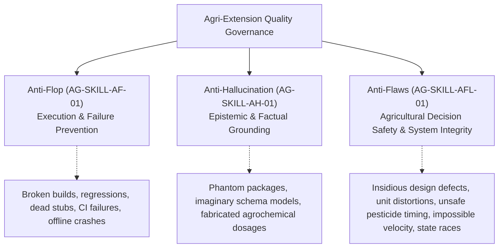
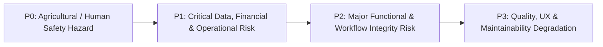
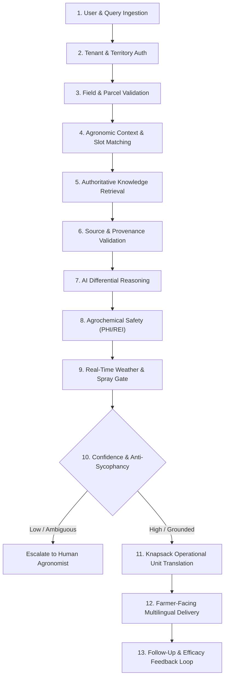

# Anti-Flaws Protocol: Agricultural Decision Safety & Engineering Integrity (AG-SKILL-AFL-01)

This protocol establishes the architectural, agronomic, security, and operational standards for the **Agri-Extension Decision Support Platform**. 

Unlike generic software enterprise checklists, this protocol is anchored in the **physical agricultural operating environment**:

$$\text{Farmer} \longrightarrow \text{Extension Officer} \longrightarrow \text{Regional Manager} \longrightarrow \text{Agronomic Knowledge / AI} \longrightarrow \text{Field Data} \longrightarrow \text{Decisions} \longrightarrow \text{Actions} \longrightarrow \text{Outcomes}$$

The overarching mandate is:
> **Can the platform prevent an incorrect, unsafe, unauthorized, misleading, or operationally impossible agricultural decision from reaching the farmer or management layer?**

---

## 1. The Quality Hierarchy: Flop vs. Hallucination vs. Flaw



* **Flop ([`anti_flop.md`](file:///home/psalmprax/ALL_PROJECTS/ag_extension_decision_support/anti_flop.md))**: Direct failure modes—broken builds, failing unit tests, dead stubs, unhandled runtime crashes, or regression breaches.
* **Hallucination ([`anti_hullicination.md`](file:///home/psalmprax/ALL_PROJECTS/ag_extension_decision_support/anti_hullicination.md))**: Epistemic untruths—claiming code works without testing, referencing non-existent npm modules, or inventing imaginary database fields.
* **Flaw (This Protocol)**: An **insidious design defect, architectural anti-pattern, agronomic safety blindspot, unit distortion, state race condition, or operational impossibility** that compiles cleanly and passes basic happy-path tests, but creates crop destruction, pesticide poisoning, data leakage, fraudulent visit reporting, or systemic unmaintainability.

---

## 2. Anti-Flaw Severity Classification Model

All platform flaws are triaged under four strict agricultural operational severity tiers:



* **P0 — Agricultural & Human Safety Hazard (Blocker)**:
  * Advice that causes crop burn, pesticide residue poisoning (exceeding MRLs), livestock toxicity, or water-table contamination.
  * Recommending chemicals inside Pre-Harvest Intervals (PHI) or Re-Entry Intervals (REI).
  * Spraying bee-toxic chemicals during peak flowering.
* **P1 — Critical Data, Financial & Operational Risk (Critical)**:
  * Cross-tenant data leaks between cooperatives or commercial agribusinesses.
  * Silent overwriting of historical field observations.
  * Plaintext exposure of farmer PII or homestead GPS coordinates.
  * Denial-of-wallet exploitation on public AI endpoints.
* **P2 — Major Functional & Workflow Integrity Risk (Major)**:
  * Extension officer logging visits with impossible travel times (teleportation).
  * Field visit completed without diagnostic observation evidence.
  * Generating chemical recommendations without translating rates into farmer knapsack operational units.
  * Offline sync conflict resolving by silently discarding field notes.
* **P3 — Quality, UX & Maintainability Degradation (Normal)**:
  * Multilingual text clipping on mobile displays.
  * Audio synthesis dropouts failing to fall back to Web Speech API.
  * Functions exceeding SonarJS cognitive complexity 15.

---

## 3. The 12-Stage Agricultural Decision Safety Gate

Before any agronomic advisory is presented to a farmer or extension officer, it must pass through the **12-Stage Agricultural Decision Safety Gate**. **Every single stage is capable of halting, rejecting, or escalating the advisory.**



1. **User & Query Ingestion**: Sanitizes input, verifies language code against [`i18n.ts`](file:///home/psalmprax/ALL_PROJECTS/ag_extension_decision_support/ag-extension-dashboard/src/frontend/src/lib/i18n.ts), and blocks prompt injection or non-agricultural queries.
2. **Tenant & Territory Authorization**: Verifies user tenant ID and validates that an extension officer is authorized for the target farmer's assigned ward/district.
3. **Field & Parcel Validation**: Confirms valid parcel ID, boundary coordinates, and historical crop rotation status.
4. **Agronomic Context & Slot Matching**: Extracts structured slots: host crop, target pest/disease, planting date, growth stage, soil pH, and field size.
5. **Authoritative Knowledge Retrieval**: Retrieves peer-reviewed extension guides, CABI biopesticide manuals, ISRIC soil grids, and FAO standards.
6. **Source & Provenance Validation**: Checks that citations are regionally applicable, legally approved, and non-conflicting.
7. **AI Differential Reasoning**: Generates clinical differential diagnoses based on observable markers; rejects superficial single-symptom leaps.
8. **Agrochemical Safety Check (PHI/REI)**: Validates that harvest date $> \text{application date} + \text{PHI}$. Rejects synthetic toxins if biological alternatives (*Bt*, Neem oil) are viable.
9. **Real-Time Weather & Spray Gate**: Checks NASA POWER and live meteorological telemetry. Halts foliar spray advice if wind $> 15$ km/h (drift risk) or rain expected $< 4$ hours (wash-off).
10. **Confidence & Anti-Sycophancy Verification**:
    * If confidence is below 85% or symptoms match multiple pathogens: **HALT** advisory, request specific physical markers, or escalate to human extension specialist.
    * Rejects farmer's false self-diagnoses with respectful evidence-based counter-analysis.
11. **Knapsack Operational Unit Translation**: Translates scientific concentrations (e.g. `2.5 L/ha` or `0.03% EC at 3ml/L`) into farmer-executable units (e.g. *"Mix 60ml (3 standard bottle caps) per 20L knapsack sprayer, applying 4 full knapsacks across your 0.5 acre plot"*).
12. **Farmer-Facing Multilingual Delivery**: Dispatches via preferred channel (PWA voice, SMS, WhatsApp) in validated native tongue with audio prosody smoothing.

---

## 4. Farmer & Field Data Integrity Protocol

1. **Immutable Observation Append-Only Trail**:
   * **Never silently overwrite field history.**
   * When an extension officer re-evaluates a field, the system must create a versioned observation record:
     $$\text{Observation} \longrightarrow \text{Validation} \longrightarrow \text{Versioned Record} \longrightarrow \text{Correction / Supersession} \longrightarrow \text{Immutable Audit Trail}$$
   * Past pest severity ratings, photographs, and soil readings must remain preserved for multi-season agronomic yield analytics.
2. **Field Polygon & Spatial Boundary Hygiene**:
   * Parcel boundary polygons must be topologically valid: no self-intersecting lines (bow-tie polygons) or zero-area geometries.
   * Adjacent farm parcels must be validated against overlap thresholds to prevent double-claiming of acreage for carbon credits or subsidized seed distribution.
3. **Historical Context Preservation**:
   * Crop rotations (e.g. maize following beans) and prior chemical applications must remain permanently accessible to prevent herbicide residual carryover damage to sensitive rotation crops.

---

## 5. Extension Officer Workflow Integrity Protocol

1. **GPS & Physical Presence Verification**:
   * Field visit start timestamps must correlate with mobile GPS telemetry within a 150-meter radius of the registered farm parcel centroid.
   * Flag visits logged without location evidence or with low-accuracy cell tower triangulation ($> 500$m error radius).
2. **Impossible Travel Time & Teleportation Detection**:
   * The system must analyze consecutive visit timestamps and physical coordinates for each officer:
     $$\text{Velocity} = \frac{\text{Geodesic Distance}(V_1, V_2)}{\text{Timestamp}(V_2) - \text{Timestamp}(V_1)}$$
   * If calculated speed exceeds plausible rural road transport limits ($> 90$ km/h between visits within a 15-minute window), flag the visit as a **Data Quality & Anomaly Signal** for manager review.
3. **Strict Workflow Sequence Enforcer**:
   * A field visit cannot be transitioned to `completed` without:
     * $\ge 1$ verified physical observation or diagnostic photograph.
     * Diagnostic finding tied to specific observable symptoms.
     * Concrete advisory with clear farmer actionable steps.
4. **Territory Compliance**:
   * Extension officers are restricted to their assigned operational zones as enforced in [`visits.ts`](file:///home/psalmprax/ALL_PROJECTS/ag_extension_decision_support/ag-extension-dashboard/src/backend/src/routes/visits.ts):
     ```typescript
     if (officerId && assignedOfficerId && officerId !== assignedOfficerId) {
       throw new Error('Visit officer must be the farmer\'s assigned extension officer');
     }
     ```

---

## 6. Agronomic Decision Safety & Treatment Protocol

1. **Pre-Harvest Interval (PHI) & Re-Entry Interval (REI) Verification**:
   * Every agrochemical recommendation must check the crop's projected harvest date against the chemical's mandated PHI.
   * If harvest is anticipated within the PHI window, **block synthetic chemical application** and prescribe non-residual organic or cultural treatments.
   * Provide explicit REI warnings to prevent farm laborers from entering treated fields prematurely.
2. **Bee Toxicity & Pollinator Protection**:
   * Do not recommend neonicotinoids or broad-spectrum insecticides during peak crop flowering periods.
   * If insecticide application is unavoidable, mandate evening/dusk application windows when bees are not actively foraging.
3. **Resistance Management & Mode of Action (MoA) Rotation**:
   * Track cumulative seasonal chemical applications per field.
   * Prevent repeated applications of single-class fungicides (e.g. FRAC Group 11 strobilurins) or insecticides (e.g. IRAC Group 1B organophosphates) to avert pathogen resistance.

---

## 7. AI / Advisory Anti-Flaws & Anti-Sycophancy

1. **Anti-Sycophancy (Objective Diagnostic Rigor)**:
   * AI copilots must be strictly trained and prompted to prioritize clinical symptoms over farmer assertions.
   * If a farmer states: *"My maize has drought stress,"* but symptoms describe Fall Armyworm windowing and frass, the copilot must politely dispute the hypothesis, explain the physical diagnostic indicators, and redirect to the correct pest treatment.
2. **Structured Entity Slots vs. Context Bloat**:
   * In [`publicDemo.ts`](file:///home/psalmprax/ALL_PROJECTS/ag_extension_decision_support/ag-extension-dashboard/src/backend/src/routes/chatbot/publicDemo.ts) and [`TalkingAssistant.tsx`](file:///home/psalmprax/ALL_PROJECTS/ag_extension_decision_support/ag-extension-dashboard/src/frontend/src/pages/landing/sections/TalkingAssistant.tsx), multi-turn consultations must track structured agronomic slots:
     ```typescript
     interface AgronomicEntitySlots {
       crop?: string | null;
       pest_disease?: string | null;
       field_size?: string | null;
       location_climate?: string | null;
       soil_profile?: string | null;
     }
     ```
   * Rolling LLM prompt history must be capped at 6 turns with compressed slot memory to eliminate token exhaustion and attention drift.
3. **Escalation Protocol**:
   * When visual symptoms are ambiguous or confidence score is $< 0.85$, the AI engine must state uncertainty and trigger human officer review. Never invent confident diagnoses under ambiguous evidence.

---

## 8. Farmer Safety, Comprehension & Localized Operational Units

1. **Scientific to Operational Unit Translation**:
   * Abstract scientific rates (e.g. `1.5 kg/ha`, `3 ml/L`) must be systematically converted into accessible field measurements based on the farmer's equipment:
     * Standard 16L / 20L knapsack sprayers.
     * Bottle-cap measures (5ml, 10ml, 20ml).
     * Handful / matchbox fertilizer micro-dosing guides.
2. **Multilingual Clarity Across 24 Languages**:
   * Voice copilots must humanize agronomic units via localized unit expanders ([`TalkingAssistant.tsx`](file:///home/psalmprax/ALL_PROJECTS/ag_extension_decision_support/ag-extension-dashboard/src/frontend/src/pages/landing/sections/TalkingAssistant.tsx)):
     * Swahili: `expandAgronomicUnitsSw` (`mililita 3 kwa lita ya maji`).
     * French: `expandAgronomicUnitsFr` (`millilitres par litre`).
     * Spanish: `expandAgronomicUnitsEs` (`mililitros por litro`).
     * Portuguese: `expandAgronomicUnitsPt` (`mililitros por litro`).

---

## 9. Offline Field Operations & Synchronization

1. **Two-Tier Envelope Encryption**:
   * Client devices store records in IndexedDB encrypted with AES-256-GCM via [`EncryptedStorageService`](file:///home/psalmprax/ALL_PROJECTS/ag_extension_decision_support/ag-extension-dashboard/src/frontend/src/services/encryptedStorageService.ts).
2. **Conflict Resolution Without Observation Destruction**:
   * When syncing offline queues, the server must never blindly execute "last-write-wins" over conflicting observations.
   * If both officer and farmer modified field notes simultaneously, retain both entries as distinct timestamped records in the field visit history.

---

## 10. Regional Manager & Operational Controls

1. **Truth in Aggregation (Non-Deceptive Metrics)**:
   * Operational analytics dashboards must distinguish between:
     * **Assigned Farmers**: Total farmers registered in officer roster.
     * **Visited Farmers**: Unique individual farmers physically visited this period.
     * **Total Field Visits**: Aggregate visit count (including repeats).
     * **Active Farmers**: Farmers adopting advisories and reporting outcomes.
   * Never conflate total visits with farmer coverage percentage.
2. **Outbreak Anomaly Detection & Geographic Clustering**:
   * Track disease and pest clusters geographically using spatial queries.
   * If $\ge 5$ farms within a 15km radius report Late Blight or Fall Armyworm within 7 days, trigger automated early-warning alerts across the regional extension network.

---

## 11. Geospatial & Environmental Context Controls

1. **WGS-84 Geodesic Acreage Sovereignty**:
   * Never calculate acreage using planar Euclidean geometry. All parcel polygons must execute over ellipsoidal geodetic projections via PostGIS `ST_Area(geog)`.
2. **Real-Time Weather Suitability Gate**:
   * Integrate NASA POWER and live station data ([`seasonalAdvisoryService.ts`](file:///home/psalmprax/ALL_PROJECTS/ag_extension_decision_support/ag-extension-dashboard/src/backend/src/services/seasonalAdvisoryService.ts)):
     * Check precipitation thresholds (planting window $\ge 25$mm, dry spell alerts $< 5$mm).
     * Prohibit spraying in high winds ($> 15$ km/h) or temperatures $> 32^\circ\text{C}$ to prevent spray vaporization.

---

## 12. Farmer Privacy & Tiered Precision Visibility

1. **Tiered Geospatial Obfuscation**:
   * **Farmer**: Exact boundary lines and parcel centroid coordinates.
   * **Assigned Extension Officer**: Exact parcel coordinates for navigation.
   * **Regional Manager**: Aggregated village / ward boundary level.
   * **National / Executive / Donor Views**: GPS jittered or aggregated to 5km grid cells to prevent predatory land acquisition or commercial data exploitation.
2. **PII Redaction**:
   * Phone numbers, IDs, and financial records must be masked in logs, telemetry streams, and Sentry breadcrumbs.

---

## 13. Outcome & Feedback Loops

1. **Closed-Loop Efficacy Tracking**:
   * Every advisory must conclude with an outcome assessment recorded in [`adviceEfficacyService.ts`](file:///home/psalmprax/ALL_PROJECTS/ag_extension_decision_support/ag-extension-dashboard/src/backend/src/services/adviceEfficacyService.ts):
     * `resolved`, `improved`, `unresolved`, `worsened`, `lost_to_followup`.
2. **Automated Knowledge Quality Degradation**:
   * If an AI or extension advisory shows an unresolved/worsened rate $> 30\%$ across a region, down-rank the RAG knowledge source and flag the protocol for national agronomic board re-evaluation.

---

## 14. Frontend Engineering Anti-Flaws Protocol

1. **React State & Asynchronous Turn Hygiene**:
   * Eradicate stale closures in voice and multi-turn loops. Pass explicit parameters across async event loops rather than closing over stale React state variables.
2. **Component Line Count Limits**:
   * Keep components under 300 lines. Decompose large views into sub-components and custom hooks (`useSpeechController`).
3. **Hardware Lifecycle Teardown**:
   * Deterministically stop all `MediaStream` tracks, close `AudioContext`, and cancel `SpeechSynthesis` upon unmount.
4. **Two-Tier Audio Synthesis**:
   * Server studio neural audio (Tier 1) with seamless 0ms fallback to native Web Speech API (Tier 2).

---

## 15. Backend Engineering Anti-Flaws Protocol

1. **Multi-Tenant Isolation**:
   * Every Prisma query on tenant models must enforce `where: { tenant_id }` to prevent cross-tenant IDOR breaches.
2. **Transactional Atomicity**:
   * Multi-table operations must be wrapped in `prisma.$transaction`.
3. **Public Demo Rate Limiting**:
   * Enforce per-IP rate limiting (10 queries/hour) in [`publicDemo.ts`](file:///home/psalmprax/ALL_PROJECTS/ag_extension_decision_support/ag-extension-dashboard/src/backend/src/routes/chatbot/publicDemo.ts).
4. **Streaming Architecture**:
   * Stream audio and imagery directly to S3/MinIO; never buffer large files monolithically in Node.js memory.

---

## 16. Comprehensive Anti-Flaw Audit Checklists

### Agronomic & Decision Safety Audit
- [ ] Are pesticide recommendations verified against PHI and REI harvest calendar margins? (P0)
- [ ] Are bee-safety windows enforced during peak flowering periods? (P0)
- [ ] Does the AI copilot reject sycophantic agreement and execute differential diagnosis? (P0)
- [ ] Is scientific dosage translated into practical knapsack sprayer units for the farmer? (P1)
- [ ] Does the system halt or escalate to human officers when confidence is below 85%? (P1)

### Field Operations & Officer Workflow Audit
- [ ] Are field visits GPS-verified within 150m of farm parcel centroids? (P1)
- [ ] Are consecutive visits validated against impossible travel velocity thresholds? (P1)
- [ ] Are historical field observations immutable and append-only? (P1)
- [ ] Does the regional dashboard distinguish between assigned, visited, and active farmers? (P2)

### Software & Architecture Audit
- [ ] Does every tenant database query enforce `where: { tenant_id }`? (P1)
- [ ] Are multi-table database operations wrapped in `prisma.$transaction`? (P1)
- [ ] Is client offline storage encrypted with AES-256-GCM envelope encryption? (P1)
- [ ] Are React asynchronous callbacks free of stale closures? (P2)
- [ ] Is every helper function's SonarJS cognitive complexity $\le 15$? (P3)
- [ ] Do all quality gates pass (`npm run lint`, `npm test`, `npm run fallow:check`, `verify:anti`)? (P0)
