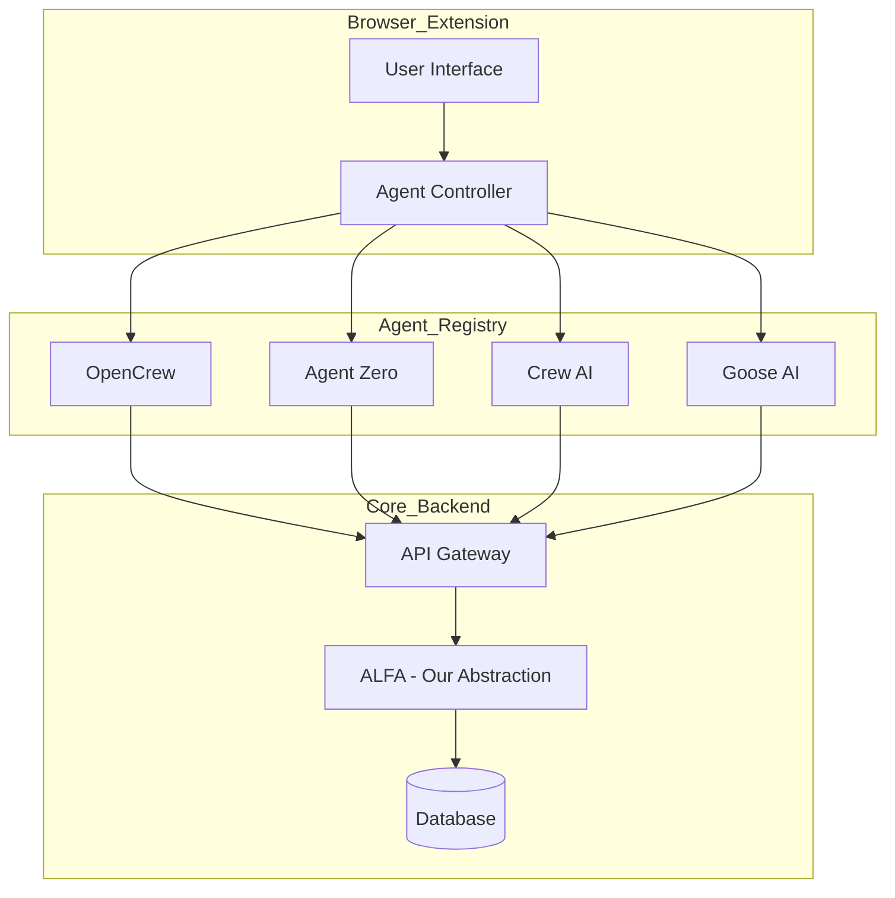

# Ag-Extension Decision Support - Browser Extension & AI Agent Integration

## Executive Summary

This document outlines the architecture for extending the Ag-Extension Decision Support Dashboard with a **Browser Extension** and integration with advanced AI agents including **OpenCrew AI**, **Agent Zero**, **Crew AI**, **Goose AI**, and other LLM-powered agents.

---

## 1. Browser Extension Architecture

### 1.1 Extension Overview

The browser extension provides:
- **Quick Access Toolbar** - Instant access to extension features from any webpage
- **Context-Aware Assistance** - AI help based on current webpage content
- **Farmer Data Capture** - Quick form filling for field data collection
- **Offline Capability** - Work without internet connection
- **Cross-Device Sync** - Seamless experience across devices

### 1.2 Technology Stack

| Component | Technology |
|-----------|------------|
| Framework | WXT (Modern Chrome Extension Framework) |
| Frontend | React + TypeScript |
| State Management | Zustand |
| Storage | IndexedDB + Chrome Storage API |
| Build Tool | Vite |
| Styling | TailwindCSS |

### 1.3 Extension Components

```
ag-extension-browser-ext/
├── manifest.json           # Extension manifest V3
├── popup/                  # Popup window UI
│   ├── App.tsx
│   └── components/
├── sidepanel/              # Side panel (full-featured)
│   ├── App.tsx
│   └── components/
├── content-scripts/        # Injected into pages
│   ├── main.ts
│   └── utils/
├── background/             # Service worker
│   └── index.ts
├── shared/                 # Shared types/utils
│   └── types/
└── assets/                # Icons, images
```

---

## 2. AI Agent Integration Architecture

### 2.1 Supported Agents

| Agent | Type | Integration Method | Use Case |
|-------|------|-------------------|----------|
| **OpenCrew AI** | Multi-agent orchestration | REST API | Complex workflows |
| **Agent Zero** | Autonomous agent | WebSocket | Real-time assistance |
| **Crew AI** | Agent crew orchestration | REST API | Task decomposition |
| **Goose AI** | LLM wrapper | HTTP API | Text generation |
| **OpenAI** | Foundation LLM | SDK/API | Primary fallback |
| **Anthropic Claude** | Foundation LLM | SDK/API | Reasoning tasks |

### 2.2 Agent Communication Protocol



### 2.3 Agent Adapter Pattern

```typescript
// Example: Base Agent Interface
interface AIAgent {
  readonly name: string;
  readonly capabilities: string[];
  
  // Execute a task
  execute(task: AgentTask): Promise<AgentResult>;
  
  // Stream response for real-time feedback
  streamExecute(task: AgentTask): AsyncGenerator<AgentResultChunk>;
  
  // Get agent status
  healthCheck(): Promise<AgentHealth>;
}

// OpenCrew Adapter
class OpenCrewAdapter implements AIAgent {
  readonly name = 'OpenCrew';
  readonly capabilities = ['orchestration', 'multi-agent', 'workflow'];
  
  async execute(task: AgentTask): Promise<AgentResult> {
    const response = await fetch('/api/agents/opencrew/execute', {
      method: 'POST',
      body: JSON.stringify(task)
    });
    return response.json();
  }
}

// Agent Zero Adapter
class AgentZeroAdapter implements AIAgent {
  readonly name = 'Agent Zero';
  readonly capabilities = ['autonomous', 'reasoning', 'tool-use'];
  
  async *streamExecute(task: AgentTask): AsyncGenerator<AgentResultChunk> {
    const response = await fetch('/api/agents/agentzero/execute', {
      method: 'POST',
      body: JSON.stringify(task)
    });
    
    const reader = response.body.getReader();
    const decoder = new TextDecoder();
    
    while (true) {
      const { done, value } = await reader.read();
      if (done) break;
      yield JSON.parse(decoder.decode(value));
    }
  }
}
```

---

## 3. Feature Specifications

### 3.1 Quick Assist Toolbar

**Description**: Floating toolbar accessible from any webpage

**Features**:
- 🌾 Quick crop query search
- 📸 Photo capture for disease identification
- 📝 Quick visit logging
- 💬 Chat with AI assistant
- 📍 GPS location capture
- 🔄 Sync with main dashboard

### 3.2 Context-Aware Page Assistance

**Supported Pages**:
- Government agricultural portals
- Weather service websites
- Market price databases
- FAO/World Bank resources
- Extension training materials

**Capabilities**:
- Extract relevant data from page
- Translate content to local language
- Summarize long documents
- Answer questions about content

### 3.3 Offline Field Mode

**Features**:
- Queue actions when offline
- Auto-sync when connection restored
- Local knowledge base access
- GPS-validated visit records

### 3.4 Multi-Agent Workflows

| Workflow | Agents Used | Description |
|----------|------------|-------------|
| Disease Diagnosis | OpenCrew + Claude | Multi-step diagnosis with expert agents |
| Visit Planning | Crew AI | Break down complex visits into tasks |
| Research Query | Agent Zero | Autonomous web research |
| Report Generation | Goose AI | Generate structured reports |
| Translation | OpenAI + Claude | Translate to local languages |

---

## 4. API Endpoints

### 4.1 Agent Management

```
GET    /api/agents                    # List available agents
GET    /api/agents/:id               # Get agent details
POST   /api/agents/:id/execute       # Execute task with agent
WS     /api/agents/:id/stream        # Stream agent response
GET    /api/agents/:id/capabilities  # Get agent capabilities
```

### 4.2 Extension Sync

```
POST   /api/extension/sync            # Sync offline data
GET    /api/extension/status         # Get sync status
POST   /api/extension/register       # Register extension instance
```

---

## 5. Implementation Phases

### Phase 1: Browser Extension Foundation (4 weeks)
- [ ] Set up WXT project structure
- [ ] Create popup UI
- [ ] Implement Chrome storage
- [ ] Build content script framework
- [ ] Set up background service worker

### Phase 2: Core AI Integration (6 weeks)
- [ ] Implement OpenAI adapter
- [ ] Implement Anthropic adapter
- [ ] Build agent registry
- [ ] Create task queue system
- [ ] Add streaming support

### Phase 3: Advanced Agents (8 weeks)
- [ ] Integrate OpenCrew AI
- [ ] Integrate Agent Zero
- [ ] Integrate Crew AI
- [ ] Integrate Goose AI
- [ ] Build multi-agent orchestration

### Phase 4: Extension Features (4 weeks)
- [ ] Offline mode
- [ ] Context-aware assistance
- [ ] Photo capture
- [ ] GPS integration
- [ ] Cross-device sync

---

## 6. Security Considerations

| Concern | Solution |
|---------|----------|
| API Key Exposure | Proxy through backend |
| Data at Rest | Encrypt extension storage |
| Data in Transit | HTTPS + WSS |
| Authentication | OAuth 2.0 flow |
| Rate Limiting | Per-agent limits |

---

## 7. Cost Estimation

| Component | Estimated Cost |
|-----------|----------------|
| Browser Extension Dev | $15,000 - $25,000 |
| OpenCrew AI Integration | $5,000 - $8,000 |
| Agent Zero Integration | $5,000 - $8,000 |
| Crew AI Integration | $5,000 - $8,000 |
| Goose AI Integration | $3,000 - $5,000 |
| **Total** | **$33,000 - $59,000** |

---

## 8. Conclusion

The browser extension combined with advanced AI agents will provide:
- **Field officers** with instant access to AI assistance anywhere
- **Multi-agent workflows** for complex agricultural problems
- **Offline capability** for remote areas
- **Seamless sync** with the main dashboard

This architecture is scalable and can accommodate future AI agents as they emerge.
