# Ag-Extension Decision Support Dashboard

## Technology-Agnostic Architecture Specification

**Version:** 1.0  
**Target Scale:** 1000+ concurrent users, multi-region deployment  
**Classification:** Government/NGO Agricultural Extension Platform

---

## 1. Architectural Overview

### 1.1 System Purpose

The Ag-Extension Decision Support Dashboard is a comprehensive platform designed to empower agricultural extension officers and the farming communities they serve. The system provides real-time knowledge access, multilingual communication capabilities, automated reporting, performance analytics, and AI-driven portfolio management—all through a modular, scalable architecture that supports multiple AI providers.

### 1.2 Architectural Philosophy

This architecture follows a **provider-agnostic, capability-first** approach:

- **Abstraction over Implementation:** Core business logic remains independent of specific AI providers
- **Capability Layering:** Each task builds upon the previous, creating a cumulative value stack
- **Event-Driven Integration:** Loose coupling between components enables independent scaling
- **Data Sovereignty Compliance:** Multi-region architecture supports regional data residency requirements

### 1.3 High-Level System Context

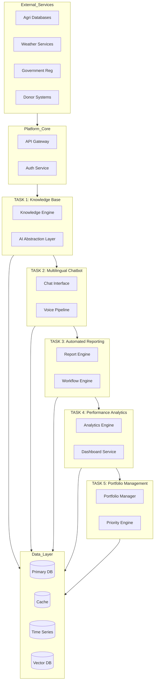

---

## 2. Core Architecture Principles

### 2.1 AI Provider Abstraction Layer (ALFA)

The AI Provider Abstraction Layer is the cornerstone of our technology-agnostic approach. It defines a standardized interface that all AI capabilities must implement, allowing the system to switch between providers without affecting upper-layer logic.

#### 2.1.1 Abstraction Interface Design

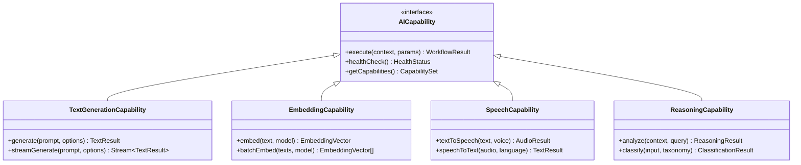

#### 2.1.2 Provider Implementation Adapters

Each AI provider implements the capability interface through adapter components:

| Capability | Azure AI | Google Vertex | OpenAI | Anthropic |
|------------|----------|---------------|--------|-----------|
| Text Generation | GPT-4 via Azure OpenAI | Gemini Pro | GPT-4/4o | Claude 3/4 |
| Embeddings | text-embedding-3 | Vertex Embeddings | text-embedding-3 | Claude Embeddings |
| Speech-to-Text | Azure Speech Services | Vertex Speech-to-Text | Whisper API | Via Integration |
| Text-to-Speech | Azure Speech Services | Vertex Text-to-Speech | Limited | Via Integration |
| Fine-tuning | Azure Fine-tuning | Vertex AutoML | OpenAI Fine-tuning | Claude Fine-tuning |

#### 2.1.3 Routing and Fallback Logic

```mermaid
flowchart LR
    REQ[Request] --> RO[Router]
    RO --> PR{Primary Provider<br/>Available?}
    PP -->|Yes| Primary Provider
    PR -->|No| FB[Fallback Provider]
    PP -->|Success| RESP[Response]
    PP -->|Failure| FB
    FB -->|Success| RESP
    FB -->|Failure| ER[Error Handler]
    
    style PR fill:#f9f,stroke:#333
    style PP fill:#9f9,stroke:#333
    style FB fill:#ff9,stroke:#333
```

---

## 3. Task-by-Task Architecture

### 3.1 Task 1: Real-Time Knowledge Base

#### 3.1.1 Purpose and Scope

The Knowledge Base serves as the foundational infrastructure for the entire platform. It aggregates agricultural data from multiple sources and provides semantic search capabilities powered by vector embeddings.

#### 3.1.2 Component Architecture

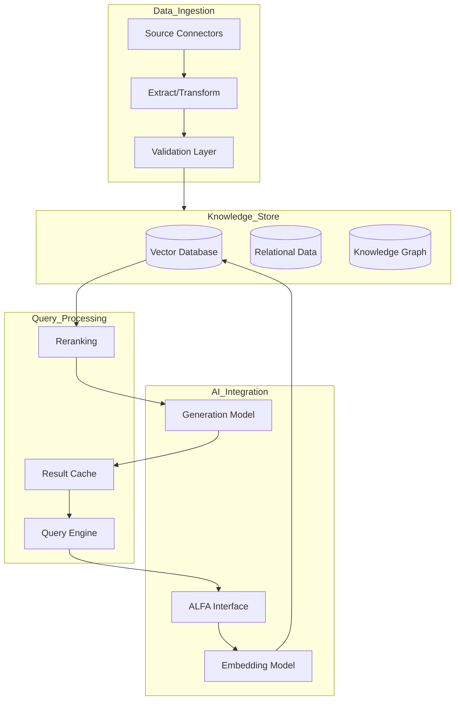

#### 3.1.3 Data Source Integration Patterns

| Source Type | Integration Pattern | Update Frequency |
|-------------|---------------------|------------------|
| Global Agri Databases | Batch plus CDC | Daily |
| Regional Repositories | Event-driven | Real-time |
| Government APIs | Scheduled Pull | Hourly |
| Weather Services | Streaming | Real-time |
| Disease Alert Networks | Webhook | On-event |
| Farmer Query Logs | Continuous | Real-time |

#### 3.1.4 Semantic Search Implementation

The knowledge base uses a hybrid search approach combining:

1. **Vector Similarity Search:** Semantic matching using dense embeddings
2. **Keyword Search:** BM25-based exact matching for technical terms
3. **Knowledge Graph Traversal:** Graph-based relationship exploration
4. **Reranking:** Cross-encoder model for result refinement

---

### 3.2 Task 2: Multilingual Chatbot

#### 3.2.1 Purpose and Scope

The chatbot provides the primary interface for farmer-extension officer interaction, supporting both text and voice in multiple local languages. This is the system's primary differentiator and user-facing touchpoint.

#### 3.2.2 Conversation Architecture

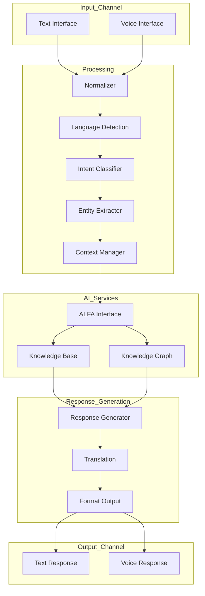

#### 3.2.3 Voice Pipeline Architecture

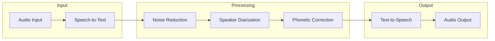

#### 3.2.4 Supported Language Strategy

| Region | Primary Languages | Voice Support Priority |
|--------|-------------------|------------------------|
| East Africa | Swahili, Amharic, Kinyarwanda | High |
| West Africa | French, Hausa, Yoruba, Twi | High |
| South Asia | Hindi, Bengali, Tamil | Medium |
| Southeast Asia | Vietnamese, Thai, Indonesian | Medium |
| Latin America | Spanish, Portuguese | Medium |

#### 3.2.5 Context Management

The chatbot maintains conversation context across sessions:

- **Session Context:** Current conversation state
- **Farmer Profile:** Farm size, crops, location, history
- **Extension Officer Context:** Assigned region, specialty
- **Geographic Context:** Weather, seasonal data, local alerts

---

### 3.3 Task 3: Automated Reporting

#### 3.3.1 Purpose and Scope

Automated reporting transforms field interactions into structured, audit-ready documents while reducing administrative burden on extension officers.

#### 3.3.2 Reporting Pipeline Architecture

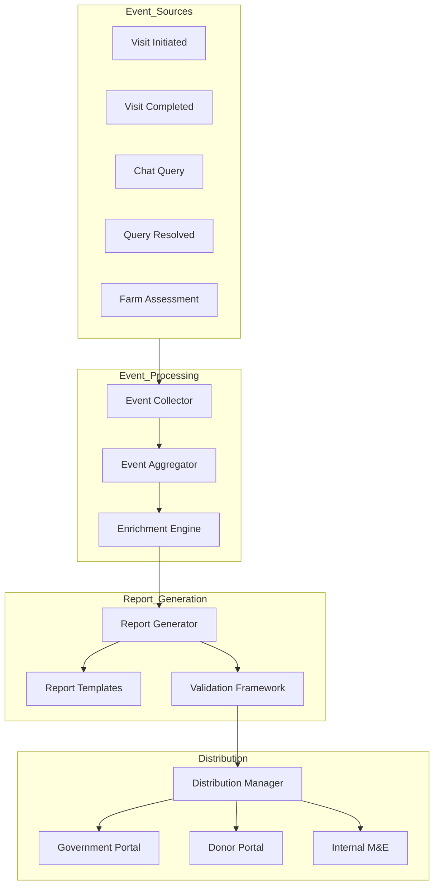

#### 3.3.3 Report Types

| Report Type | Generation Trigger | Audience | Format |
|-------------|-------------------|----------|--------|
| Visit Log | Visit completion | Officer, Supervisor | Structured JSON, PDF |
| Impact Summary | Daily aggregation | Program Manager | Dashboard, PDF |
| Service Delivery Evidence | Real-time | Donors, Government | Structured XML, PDF |
| Farmer Query Resolution | Query closure | Extension Network | CSV, JSON |
| Monthly Activity Report | Monthly schedule | All stakeholders | PDF, Excel |

#### 3.3.4 Validation and Quality Assurance

- Automatic completeness checks against required fields
- Plausibility validation: visit duration vs. travel time
- Anomaly detection for outlier data points
- Supervisor approval workflows for flagged reports

---

### 3.4 Task 4: Performance Analytics

#### 3.4.1 Purpose and Scope

The analytics dashboard provides real-time visibility into extension service operations, enabling data-driven decision-making and performance optimization.

#### 3.4.2 Analytics Architecture

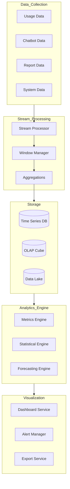

#### 3.4.3 Key Metrics Dashboard

| Metric Category | Specific Metrics | Update Frequency |
|-----------------|-------------------|------------------|
| Geographic Reach | Villages covered, farmers reached, density maps | Real-time |
| Response Performance | Chatbot response time, resolution rate, escalation rate | Real-time |
| Service Quality | Satisfaction scores, follow-up rates, query categories | Hourly |
| Officer Performance | Visits completed, time per visit, coverage efficiency | Daily |
| System Health | API latency, error rates, uptime | Real-time |

#### 3.4.4 Benchmarking Capabilities

- Regional comparison views
- Season-over-season analysis
- Officer cohort performance
- Crop-specific outcomes

---

### 3.5 Task 5: Ag-Extension Portfolio Management

#### 3.5.1 Purpose and Scope

Portfolio management transforms extension services from reactive to proactive by using AI to prioritize and recommend field activities based on urgency signals and impact potential.

#### 3.5.2 Priority Engine Architecture

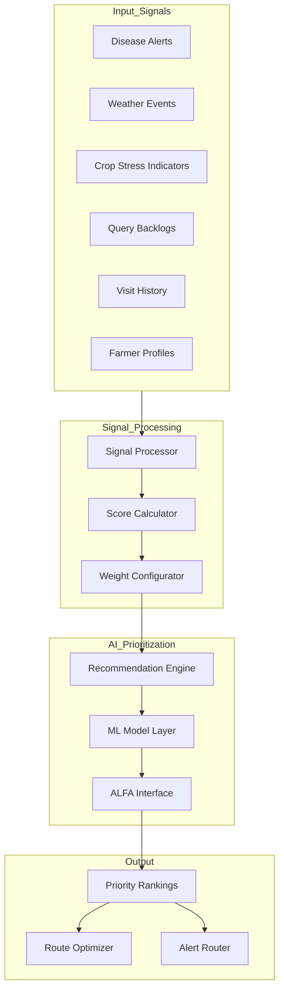

#### 3.5.3 Urgency Signal Weighting

| Signal Type | Data Source | Weight Configuration | Update Frequency |
|-------------|-------------|---------------------|------------------|
| Disease Alerts | FAO, Regional Plant Health | Configurable by region | Real-time |
| Weather Events | Weather APIs, NOAA, ECMWF | Severity-based | Real-time |
| Crop Stress | Satellite imagery, IoT sensors | Crop-stage adjusted | Daily |
| Query Backlog | System queue depth | Aging-weighted | Hourly |
| Visit Recency | Visit history | Farm-type adjusted | Real-time |

#### 3.5.4 Route Optimization

- Traveling salesman optimization for field visits
- Multi-day trip planning
- Time-window constraints
- Travel time estimation

---

## 4. Integration Architecture

### 4.1 System Integration Patterns

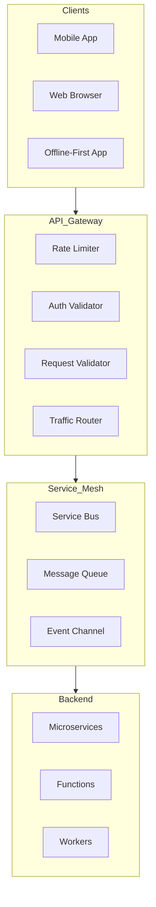

### 4.2 API Design Principles

- RESTful APIs for synchronous operations
- GraphQL for flexible dashboard queries
- WebSocket for real-time updates
- Webhook endpoints for external integrations

### 4.3 Event-Driven Architecture

All inter-component communication uses events:

| Event Type | Publisher | Subscribers |
|------------|-----------|-------------|
| Query Received | Chatbot Service | Analytics, Reporting |
| Visit Completed | Reporting Service | Analytics, Portfolio |
| Alert Triggered | External Integration | Portfolio, Chatbot |
| Report Generated | Reporting Service | Distribution, Analytics |

---

## 5. Data Architecture

### 5.1 Data Storage Strategy

| Data Type | Storage Technology | Access Pattern | Retention |
|-----------|-------------------|----------------|-----------|
| Relational Data | PostgreSQL primary | Transactional | Long-term |
| Documents | MongoDB/CosmosDB | Document | Long-term |
| Vector Embeddings | Pinecone/Weaviate | Semantic search | Long-term |
| Time Series | InfluxDB/Timescale | Analytics | 7 years |
| Cache | Redis | Real-time | TTL-based |
| Blob Storage | S3/Azure Blob | Media, reports | Long-term |

### 5.2 Data Flow Architecture

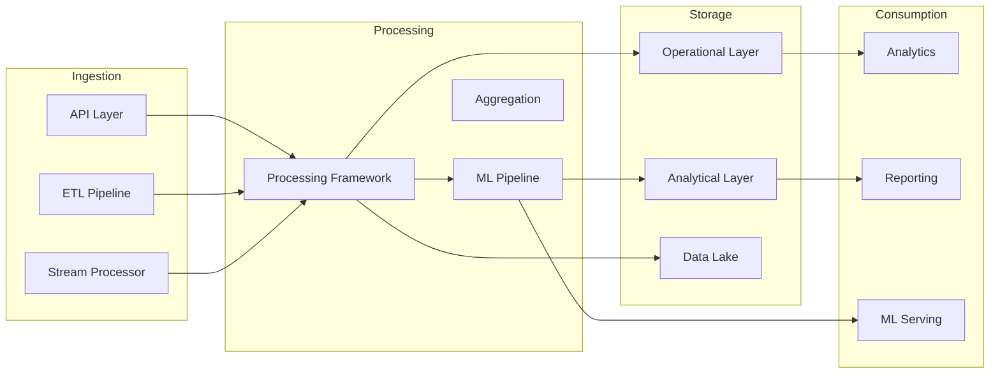

---

## 6. Security and Compliance

### 6.1 Security Architecture

| Layer | Implementation |
|-------|---------------|
| Authentication | OAuth 2.0, JWT tokens, MFA support |
| Authorization | RBAC with fine-grained permissions |
| Data Encryption | TLS 1.3 in transit, AES-256 at rest |
| API Security | Rate limiting, request validation, WAF |
| Audit Logging | Immutable audit trails for all operations |

### 6.2 Data Sovereignty

- Multi-region deployment support
- Regional data residency compliance
- PII handling with consent management
- Data anonymization for analytics

---

## 7. Deployment Architecture

### 7.1 Recommended Deployment Pattern

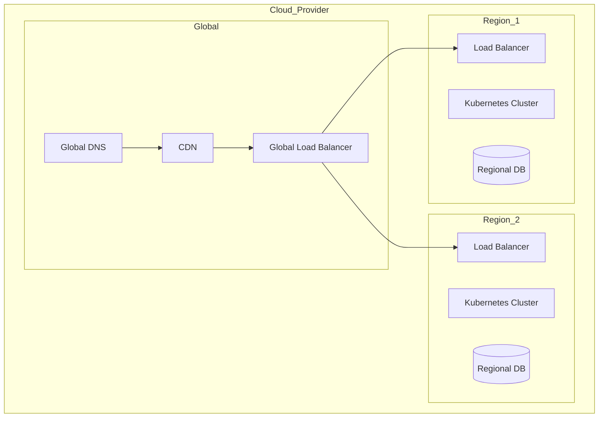

### 7.2 Infrastructure Requirements

| Component | Specification | Notes |
|-----------|---------------|-------|
| Kubernetes | Managed K8s AKS/EKS/GKE | Multi-zone |
| Database | Managed PostgreSQL with read replicas | Auto-failover |
| Cache | Redis Cluster | Multi-region |
| Vector DB | Pinecone/Weaviate Cloud | Managed service |
| CDN | Cloudflare/Fastly | Global edge |
| Monitoring | Prometheus plus Grafana | Full observability |

---

## 8. Implementation Phases

### 8.1 Phase Dependencies

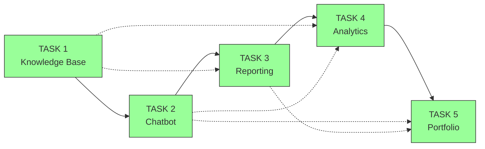

### 8.2 Phase Timeline

| Phase | Duration | Key Deliverables |
|-------|----------|------------------|
| Phase 1 | 8-12 weeks | Knowledge base infrastructure, basic search, ALFA implementation |
| 6-8 Phase 2 | weeks | Chatbot interface, multilingual support, voice pipeline |
| Phase 3 | 4-6 weeks | Automated reporting engine, template system |
| Phase 4 | 4-6 weeks | Analytics dashboard, metrics computation |
| Phase 5 | 6-8 weeks | Portfolio management, priority engine, route optimization |

---

## 9. Technology Selection Guidelines

### 9.1 Abstraction Layer Implementation

The architecture supports the following technology choices while maintaining provider independence:

| Layer | Recommended Options |
|-------|---------------------|
| API Gateway | Kong, AWS API Gateway, Azure API Management |
| Service Mesh | Istio, Linkerd, AWS App Mesh |
| Message Queue | Apache Kafka, RabbitMQ, AWS SQS |
| Container Orchestration | Kubernetes any cloud provider |
| Observability | Prometheus, Grafana, Jaeger |

### 9.2 AI Provider Configuration

```yaml
ai_providers:
  primary:
    provider: "azure_openai"
    model: "gpt-4"
    region: "eastus"
  
  fallback:
    provider: "google_vertex"
    model: "gemini-pro"
    region: "us-central1"
  
  embeddings:
    provider: "openai"
    model: "text-embedding-3-large"
  
  speech:
    provider: "azure_speech"
    voice: "standard"
```

---

## 10. Risk Mitigation

| Risk | Mitigation Strategy |
|------|---------------------|
| AI Provider lock-in | ALFA abstraction layer, provider rotation capability |
| Data sovereignty | Regional deployment, data residency controls |
| Scalability constraints | Horizontal scaling design, async processing |
| Connectivity issues | Offline-first mobile app, local caching |
| Model accuracy | Human-in-the-loop validation, continuous feedback loops |
| Security threats | Defense-in-depth, regular security audits |

---

## 11. Success Metrics

| Phase | Key Success Indicators |
|-------|------------------------|
| Task 1 | Knowledge base coverage, search relevance R@10 greater than 0.8 |
| Task 2 | Chatbot engagement rate, language coverage, voice adoption |
| Task 3 | Report completion rate, administrative time reduction greater than 50 percent |
| Task 4 | Dashboard adoption, decision-making speed improvement |
| Task 5 | Visit prioritization accuracy, proactive intervention rate |

---

This architecture provides a comprehensive, technology-agnostic foundation for implementing the Ag-Extension Decision Support Dashboard. The modular design ensures flexibility in AI provider selection while maintaining scalability for large-scale deployment across multiple regions.
