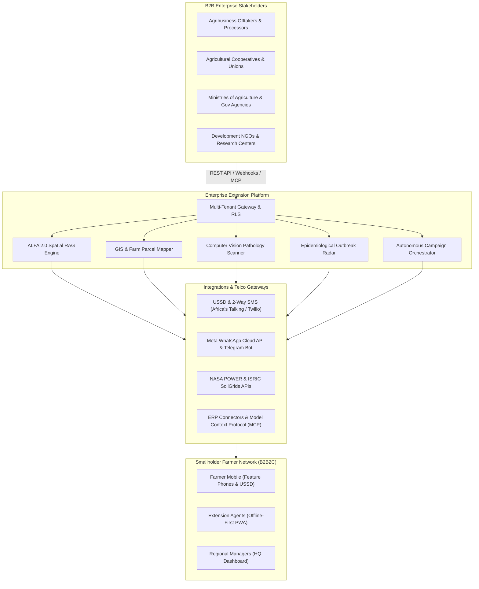

# B2B & Enterprise Services Specification

This document details the enterprise and business-to-business (B2B) capabilities, service architecture, and operational workflows provided by the **Agricultural Extension Decision Support Platform**.

---

## 1. Enterprise Architecture Overview

---

## 2. The 6 Core B2B Service Pillars

### Pillar 1: Autonomous Farmer Communication & Triage (B2B2C Suite)
* **Omni-Channel Farmer Gateway**: Reaches smallholder farmers on low-tech feature phones via **USSD (no data required)**, interactive **2-way SMS**, and smartphones via **WhatsApp Business API** and **Telegram**.
* **Autonomous Agronomic Campaigns**: Agribusinesses and co-ops can schedule and dispatch targeted seasonal advisories (planting alerts, fertilizer timing, rainfall anomalies) across 10,000+ farmers with real-time delivery confirmation.
* **Intelligent Triage & Tele-Agronomy**: Inquiries are scored for urgency; high-risk crop issues are escalated to human extension officers with 1-click SMS/voice/video consultation handoffs.

### Pillar 2: GIS Parcel Mapping & Field Operations Management
* **Interactive Parcel GIS**: Dynamic cartography visualizing farm boundaries, GPS coordinates, acreage, and crop distribution layered over Esri Satellite, Terrain, and OpenStreetMap.
* **Field Officer Dispatch & Visit Tracking**: Plan on-site agronomist inspections, assign priority routes, and track issue resolution across administrative sectors.
* **Offline-First PWA Synchronization**: Field officers working in remote zero-connectivity zones record field observations, soil chemistry tests, and crop growth stages; data automatically synchronizes when cellular connectivity is restored.

### Pillar 3: AI Diagnostics & Satellite Climate Intelligence
* **Plant Pathology Scanner (Computer Vision)**: On-device (TensorFlow.js/ONNX) and cloud-based disease classification (e.g. Fall Armyworm, Maize Lethal Necrosis, Coffee Rust, Late Blight) with visual saliency heatmaps.
* **NASA POWER Climate Modeling**: GPS-specific solar irradiance, topsoil moisture anomalies, thermal growing-degree days (GDD), and drought/frost forecasting worldwide.
* **ISRIC World SoilGrids Chemistry**: 250m-resolution soil profiles (pH, Nitrogen, Organic Carbon, Cation Exchange Capacity) to generate precise fertilizer and lime dosage matrices.

### Pillar 4: Yield Forecasting, Efficacy & Outbreak Intelligence
* **Supply-Chain Yield Forecasting**: Real-time aggregation of active crop cycles and field health metrics to forecast seasonal harvest volume for food processors and off-takers.
* **Advisory Efficacy Auditing**: Continuous tracking verifying whether agronomic recommendations led to documented yield improvements and reduced crop loss.
* **Spatial Epidemiological Radar**: Spatial clustering with $k$-anonymity ($k \ge 3$) alerting agribusinesses and government agencies when a contagious pest or pathogen begins spreading across adjacent districts.

### Pillar 5: Multi-Tenant Data Governance & ERP Integrations
* **Database Row-Level Security (RLS)**: Strict tenant isolation via PostgreSQL RLS guaranteeing enterprise data sovereignty between competing co-ops or ministries.
* **Developer APIs & Model Context Protocol (MCP)**: Bi-directional synchronization with corporate ERPs (SAP, Farmforce, Agrichain) using scoped API keys, webhooks, and MCP tools.
* **Bulk Data Operations**: High-throughput CSV/Excel batch pipelines for importing and exporting thousands of farmer profiles, soil analyses, and harvest outcomes.
* **Cryptographic Consent (OCap)**: Object-Capability security model ensuring full compliance with international data protection laws (GDPR, Kenya DPA, Nigeria NDPR).

### Pillar 6: Custom Enterprise Knowledge Base (Private RAG)
* **Proprietary Knowledge Ingestion**: Ingest corporate agronomy handbooks, certified seed guides, and proprietary agrochemical safety documentation into private vector knowledge graphs for dedicated AI reasoning.

---

## 3. B2B Stakeholder Matrix & Value Realization

| Stakeholder | Key Features Leveraged | Primary Business Outcome |
| :--- | :--- | :--- |
| **Agribusinesses & Offtakers** | Yield Forecasting, Autonomous SMS/WhatsApp Campaigns, Supply Chain Traceability | Predictable harvest yields, reduced default risk on input financing, supply assurance. |
| **Agricultural Cooperatives** | Bulk Farmer Onboarding, Group SMS Broadcasts, Shared Equipment & Seed Logistics | Higher member retention, coordinated fertilizer buying power, lower loss rates. |
| **Ministries of Agriculture** | Regional Manager Scoping, Epidemiological Outbreak Radar, National Soil Grids | Early pathogen containment, data-driven food security policy, extension officer efficiency. |
| **Development NGOs** | Efficacy Audits, Offline-First Mobile PWA, Multi-Language Advisory | Verified impact measurement, transparent donor reporting, scalable farmer support. |

---

## 4. B2B Integration & Onboarding Touchpoints in the Dashboard

1. **Telco & Communication Gateway Onboarding**: `Settings > Communication Channels` (`ChannelOnboardingModal.tsx`).
2. **Bulk Farmer Data Ingestion**: `Portfolio > Bulk Operations > Import CSV` (`bulkOperationsService.ts`).
3. **Staff & Hierarchy Provisioning**: `Sidebar > Users` (`UserManagementPage.tsx` — Admin, Regional Manager, Officer roles).
4. **Tenant Configuration & Currency/Locale Scoping**: `Settings > Organization Config` (`/api/organizations/config`).
5. **Developer Webhooks & ERP Tool Connectors**: `Settings > Developer & MCP Tools` (`MCPTools.tsx`).
6. **Enterprise Tier & Quota Management**: `Sidebar > Billing Dashboard` (`BillingDashboard.tsx` & `AccessAndCostMatrix.tsx`).
