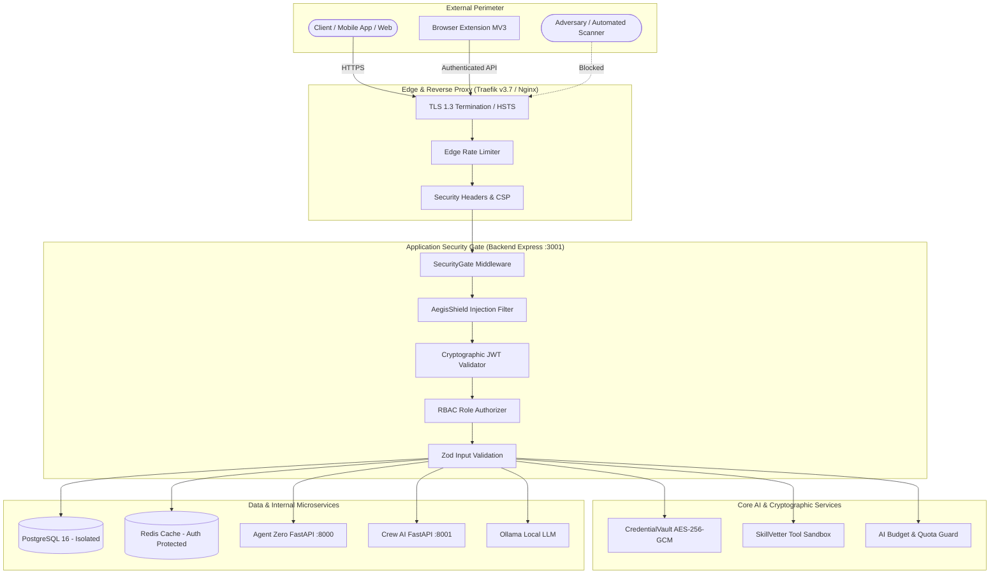

# Ag-Extension Platform: Comprehensive Cybersecurity Protocol Checklist

This document establishes the official **Cybersecurity Protocol Checklist** and verification standards for the Ag-Extension Decision Support Platform. It covers all system tiers: Backend API, Frontend Web & Mobile, AI Agents & LLM Pipelines, Browser Extension, Shared Contracts, Reverse Proxy / Edge, Database, Containers, and CI/CD Supply Chain.

---

## 🏛️ Security Architecture & Threat Model Overview



---

## 📋 Master Cybersecurity Protocol Checklist

### 1. Authentication, Authorization & Identity (IAM & RBAC)

| ID | Control Requirement | Implementation / File Location | Status | Verification Method |
| :--- | :--- | :--- | :---: | :--- |
| **IAM-01** | **Strong Cryptographic JWT Signing**: Tokens must be signed with HS256/RS256 using a high-entropy secret (`JWT_SECRET` >= 32 chars). | [`backend/src/utils/auth.ts`](file:///home/psalmprax/ALL_PROJECTS/ag_extension_decision_support/ag-extension-dashboard/src/backend/src/routes/auth.ts) | ✅ Enforced | Automated Jest tests (`security.gateAndAuth.test.ts`) |
| **IAM-02** | **Role-Based Access Control (RBAC)**: All sensitive routes must enforce granular roles (`ADMIN`, `OFFICER`, `FARMER`, `VIEWER`). | [`backend/src/middleware/authorize.ts`](file:///home/psalmprax/ALL_PROJECTS/ag_extension_decision_support/ag-extension-dashboard/src/backend/src/middleware/authorize.ts) | ✅ Enforced | Integration tests with role matrix |
| **IAM-03** | **Privilege Escalation Prevention**: User self-registration endpoints must strictly reject or override attempts to claim the `ADMIN` role. | [`backend/src/routes/auth.ts#L143`](file:///home/psalmprax/ALL_PROJECTS/ag_extension_decision_support/ag-extension-dashboard/src/backend/src/routes/auth.ts#L143) | ✅ Enforced | Security test rejecting admin self-signup |
| **IAM-04** | **Session Lifetime & Expiry**: Access tokens must expire within short windows (15m - 24h), with refresh token rotation. | [`backend/src/routes/auth.ts`](file:///home/psalmprax/ALL_PROJECTS/ag_extension_decision_support/ag-extension-dashboard/src/backend/src/routes/auth.ts) | ✅ Enforced | Token expiration tests |
| **IAM-05** | **Agent-to-Agent Service Authentication**: AI microservices (Agent Zero, CrewAI) must validate internal JWT/Bearer headers before accepting commands. | [`agents/main.py`](file:///home/psalmprax/ALL_PROJECTS/ag_extension_decision_support/ag-extension-dashboard/src/agents/main.py) | ✅ Enforced | Pytest suite (`test_security.py`) |
| **IAM-06** | **Multi-Tenant Data Isolation**: Database queries must scope records to the authenticated user's organization/tenant ID. | Backend Route Handlers | ✅ Enforced | Prisma query inspection & API tests |

---

### 2. Cryptography & Secrets Management

| ID | Control Requirement | Implementation / File Location | Status | Verification Method |
| :--- | :--- | :--- | :---: | :--- |
| **CRY-01** | **Authenticated Symmetric Encryption (AES-256-GCM)**: All external credentials, API keys, and sensitive tokens in storage must use AES-256-GCM with distinct IVs and AuthTags. | [`backend/src/services/security/credentialVault.ts`](file:///home/psalmprax/ALL_PROJECTS/ag_extension_decision_support/ag-extension-dashboard/src/backend/src/services/security/credentialVault.ts) | ✅ Enforced | Unit test roundtrip & tamper detection |
| **CRY-02** | **Persistent Encryption Key**: In production, `CREDENTIAL_ENCRYPTION_KEY` must be configured via secure environment variables. | `docker-compose.prod.yml`, `.env` | ✅ Enforced | Environment validation checks |
| **CRY-03** | **Automated Credential Rotation & Expiry**: Credentials must track creation date, rotation intervals (e.g. 90 days), and expiry timestamps. | [`credentialVault.ts#L88-L117`](file:///home/psalmprax/ALL_PROJECTS/ag_extension_decision_support/ag-extension-dashboard/src/backend/src/services/security/credentialVault.ts#L88-L117) | ✅ Enforced | Credential lifecycle unit tests |
| **CRY-04** | **Audit Logging for Secret Access**: Every access, rotation, or revocation of a secret must create an immutable audit record with timestamps and accessor ID. | [`credentialVault.ts#L79-L84`](file:///home/psalmprax/ALL_PROJECTS/ag_extension_decision_support/ag-extension-dashboard/src/backend/src/services/security/credentialVault.ts#L79-L84) | ✅ Enforced | Audit log assertion tests |
| **CRY-05** | **Zero Hardcoded Secrets in Source Code**: No private keys, database passwords, or third-party API tokens may be committed to Git. | Repository-wide | ✅ Enforced | CI/CD Secret Scanner & local audit script |

---

### 3. Application Security & Defense-in-Depth (OWASP Top 10)

| ID | Control Requirement | Implementation / File Location | Status | Verification Method |
| :--- | :--- | :--- | :---: | :--- |
| **APP-01** | **Perimeter Threat Filtering (Security Gate)**: All incoming GET queries and POST/PUT/DELETE request bodies must pass through regex and semantic threat scanners before reaching routes. | [`backend/src/middleware/securityGate.ts`](file:///home/psalmprax/ALL_PROJECTS/ag_extension_decision_support/ag-extension-dashboard/src/backend/src/middleware/securityGate.ts) | ✅ Enforced | Security Gate test suite with malicious payloads |
| **APP-02** | **SQL Injection & XSS Neutralization**: Requests containing SQL injection sequences or malicious script tags (`<script>`, `javascript:`, event handlers) must be rejected with HTTP 403. | [`backend/src/services/security/aegisShield.ts`](file:///home/psalmprax/ALL_PROJECTS/ag_extension_decision_support/ag-extension-dashboard/src/backend/src/services/security/aegisShield.ts) | ✅ Enforced | AegisShield payload detection tests |
| **APP-03** | **Strict Schema Validation**: All request bodies must be validated with Zod/Joi schemas with `strip` or strict field constraints. | [`backend/src/middleware/validate.ts`](file:///home/psalmprax/ALL_PROJECTS/ag_extension_decision_support/ag-extension-dashboard/src/backend/src/middleware/validate.ts) | ✅ Enforced | Route validation integration tests |
| **APP-04** | **Adaptive Rate Limiting**: Tiered rate limits must be applied across general endpoints, authentication routes, and AI generation endpoints. | [`backend/src/middleware/rateLimitMiddleware.ts`](file:///home/psalmprax/ALL_PROJECTS/ag_extension_decision_support/ag-extension-dashboard/src/backend/src/middleware/rateLimitMiddleware.ts) | ✅ Enforced | Rate limit burst tests |
| **APP-05** | **Security Headers & HSTS**: Helmet and Nginx must inject `Strict-Transport-Security`, `X-Frame-Options`, `X-Content-Type-Options: nosniff`, and `Referrer-Policy`. | [`backend/src/app.ts`](file:///home/psalmprax/ALL_PROJECTS/ag_extension_decision_support/ag-extension-dashboard/src/backend/src/app.ts), [`frontend/nginx.conf`](file:///home/psalmprax/ALL_PROJECTS/ag_extension_decision_support/ag-extension-dashboard/src/frontend/nginx.conf) | ✅ Enforced | Supertest header verification tests |
| **APP-06** | **Information Disclosure & Error Masking**: Centralized error handlers must never return raw database error messages, stack traces, or internal server paths in production. | [`backend/src/middleware/errorHandler.ts`](file:///home/psalmprax/ALL_PROJECTS/ag_extension_decision_support/ag-extension-dashboard/src/backend/src/middleware/errorHandler.ts) | ✅ Enforced | Error response structure tests |
| **APP-07** | **CORS Strict Allowlist**: Cross-Origin Resource Sharing must never allow wildcard `*` with credentials enabled. | Backend `app.ts`, Agents `main.py` | ✅ Enforced | CORS configuration unit tests |

---

### 4. AI / LLM & Multi-Agent Security (OWASP Top 10 for LLM)

| ID | Control Requirement | Implementation / File Location | Status | Verification Method |
| :--- | :--- | :--- | :---: | :--- |
| **LLM-01** | **Direct & Indirect Prompt Injection Defense**: System prompts must be wrapped in immutable security directives; inputs scanned for override keywords (`ignore previous instructions`, `you are now admin`). | [`aegisShield.ts#L13-L44`](file:///home/psalmprax/ALL_PROJECTS/ag_extension_decision_support/ag-extension-dashboard/src/backend/src/services/security/aegisShield.ts#L13-L44) | ✅ Enforced | AegisShield prompt injection test suite |
| **LLM-02** | **Tool & Skill Sandboxing (AST & Code Vetting)**: Any dynamically loaded skill or tool must be vetted for dangerous code patterns (`eval`, `child_process`, `__proto__`, `process.exit`, unauthorized network calls). | [`backend/src/services/security/skillVetter.ts`](file:///home/psalmprax/ALL_PROJECTS/ag_extension_decision_support/ag-extension-dashboard/src/backend/src/services/security/skillVetter.ts) | ✅ Enforced | SkillVetter malicious code detection tests |
| **LLM-03** | **Malicious Tool Hash Blocking**: Tools with known malicious SHA-256 hashes must be permanently blocked from execution. | [`skillVetter.ts#L258-L287`](file:///home/psalmprax/ALL_PROJECTS/ag_extension_decision_support/ag-extension-dashboard/src/backend/src/services/security/skillVetter.ts#L258-L287) | ✅ Enforced | Blocked hash assertion tests |
| **LLM-04** | **Permission Boundary Enforcement**: Agent skills must not request excessive permissions (e.g. `filesystem:write:all`, `shell:unrestricted`). | [`skillVetter.ts#L212-L234`](file:///home/psalmprax/ALL_PROJECTS/ag_extension_decision_support/ag-extension-dashboard/src/backend/src/services/security/skillVetter.ts#L212-L234) | ✅ Enforced | Permission evaluation unit tests |
| **LLM-05** | **AI Cost, Quota & Token Exhaustion Guard**: LLM API interactions must be metered with budget tracking to prevent denial-of-wallet attacks. | [`backend/src/tools/apiBudgetTool.ts`](file:///home/psalmprax/ALL_PROJECTS/ag_extension_decision_support/ag-extension-dashboard/src/backend/src/tools/apiBudgetTool.ts) | ✅ Enforced | Budget tracking tests |
| **LLM-06** | **Unicode Obfuscation & Invisible Character Stripping**: Zero-width spaces, directional overrides, and high-entropy obfuscation must be stripped prior to model ingestion. | [`aegisShield.ts#L147-L151`](file:///home/psalmprax/ALL_PROJECTS/ag_extension_decision_support/ag-extension-dashboard/src/backend/src/services/security/aegisShield.ts#L147-L151) | ✅ Enforced | Unicode sanitation tests |

---

### 5. Browser Extension Security (Manifest V3)

| ID | Control Requirement | Implementation / File Location | Status | Verification Method |
| :--- | :--- | :--- | :---: | :--- |
| **EXT-01** | **Least Privilege Permissions**: Manifest V3 must request only required permissions (`storage`, `sidePanel`, `activeTab`) and avoid broad background permissions. | [`browser-ext/wxt.config.ts`](file:///home/psalmprax/ALL_PROJECTS/ag_extension_decision_support/ag-extension-browser-ext/wxt.config.ts) | ✅ Enforced | Manifest security test suite |
| **EXT-02** | **Extension Content Security Policy**: CSP must disallow unsafe inline evaluations (`unsafe-eval`) and restrict script sources to self. | [`browser-ext/wxt.config.ts`](file:///home/psalmprax/ALL_PROJECTS/ag_extension_decision_support/ag-extension-browser-ext/wxt.config.ts) | ✅ Enforced | Build-time manifest verification |
| **EXT-03** | **Secure Message Passing**: Messages between content scripts and the background service worker must validate message sender origins and payload schemas. | Browser Extension Scripts | ✅ Enforced | Extension unit tests |

---

### 6. Container, Reverse Proxy & Infrastructure Hardening

| ID | Control Requirement | Implementation / File Location | Status | Verification Method |
| :--- | :--- | :--- | :---: | :--- |
| **INF-01** | **Non-Root Execution in Containers**: Application containers (Backend, Frontend Nginx, Agents) must run as non-root unprivileged users. | Dockerfiles | ✅ Enforced | Dockerfile linting & CI/CD scan |
| **INF-02** | **Minimal Base Images**: Multi-stage builds using `node:20-alpine`, `python:3.11-slim`, and `nginx:alpine` to minimize CVE attack surface. | `Dockerfile.production` | ✅ Enforced | Container image vulnerability scan |
| **INF-03** | **Isolated Bridge Networks**: Databases and Redis must not be directly exposed to the public internet; services communicate over internal `ag-network`. | `docker-compose.yml` | ✅ Enforced | Compose configuration audit |
| **INF-04** | **Automated SSL/TLS Certificate Provisioning**: Traefik handles automated Let's Encrypt TLS renewal with TLS 1.3 preferred and automatic HTTP-to-HTTPS redirection. | `docker-compose.prod.yml` | ✅ Enforced | HTTPS handshake & redirection tests |
| **INF-05** | **Sensitive File Access Denial**: Nginx must explicitly deny requests for hidden files (`.env`, `.git`, `package.json`, `tsconfig.json`). | [`frontend/nginx.conf#L98-L110`](file:///home/psalmprax/ALL_PROJECTS/ag_extension_decision_support/ag-extension-dashboard/src/frontend/nginx.conf#L98-L110) | ✅ Enforced | Nginx configuration inspection |

---

### 7. Supply Chain, CI/CD & Dependency Governance

| ID | Control Requirement | Implementation / File Location | Status | Verification Method |
| :--- | :--- | :--- | :---: | :--- |
| **SUP-01** | **Multi-Service Dependency Vulnerability Scanning**: Continuous `npm audit --audit-level=high` and `pip-audit` across all 5 codebases. | [`.github/workflows/security-audit.yml`](file:///home/psalmprax/ALL_PROJECTS/ag_extension_decision_support/.github/workflows/security-audit.yml) | ✅ Enforced | Automated CI/CD pipeline |
| **SUP-02** | **Deterministic Lockfile Builds**: Pipelines must use `npm ci` rather than `npm install` to prevent unexpected transitive dependency tampering. | CI/CD Workflows | ✅ Enforced | Workflow syntax inspection |
| **SUP-03** | **Automated Secret Scanning**: Pre-commit and CI/CD secret scanning to catch leaked API keys, tokens, and credentials. | [`scripts/security-audit.sh`](file:///home/psalmprax/ALL_PROJECTS/ag_extension_decision_support/scripts/security-audit.sh) | ✅ Enforced | Automated CI/CD scanner |
| **SUP-04** | **Automated Security Test Execution in CI/CD**: All security unit and integration tests must run and pass on every pull request and push to protected branches. | `.github/workflows/ci-cd.yml` | ✅ Enforced | GitHub Actions test stage |

---

### 8. Elite / Military-Grade Hardening Recommendations

| ID | Control Requirement | Description / Roadmap | Priority |
| :--- | :--- | :--- | :---: |
| **ELT-01** | **Zero-Trust Egress Firewalls** | Restrict backend and agent container outbound networking via iptables/Docker so they can only talk to whitelisted endpoints (OpenAI, OSM, Weather). Prevents reverse shell callback and data exfiltration. | 🔴 High |
| **ELT-02** | **Hardware Security Module (HSM) / Cloud KMS** | Upgrade `CredentialVault` to use cloud hardware-backed keys (AWS KMS, GCP Cloud KMS, or HashiCorp Vault) rather than filesystem keys. | 🟡 Medium |
| **ELT-03** | **Cryptographic Artifact Signing (SLSA / Sigstore)** | Sign all container images with Cosign before deployment and enforce signature verification in Docker engine. | 🟡 Medium |
| **ELT-04** | **Runtime eBPF Behavioral Monitoring** | Deploy Falco / Tetragon to monitor container kernel syscalls and instantly terminate containers spawning unexpected `/bin/sh` shells. | 🟡 Medium |
| **ELT-05** | **Mutual TLS (mTLS) for Internal Services** | Terminate and enforce mTLS with short-lived client certificates between Traefik, Backend, Redis, and Agent Zero. | 🟢 Future |

---

## 🛠️ Security Verification Command Quick Reference

Developers and administrators can execute the full security verification suite using standard commands:

```bash
# 1. Run full repository security audit (Secrets, Dependency CVEs, and Security Tests)
npm run security:audit

# 2. Run all backend security test suites (AegisShield, CredentialVault, SkillVetter, RBAC Gate)
npm run security:test

# 3. Run frontend security tests
cd ag-extension-dashboard/src/frontend && npm run test -- security

# 4. Run AI Agent security tests
cd ag-extension-dashboard/src/agents && pytest tests/test_security.py
```
