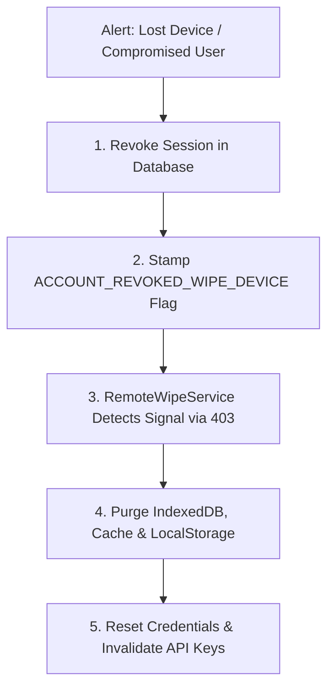

# Ag-Extension Platform: Master Cybersecurity & Threat Response Playbook

## 🏛️ Executive Summary & Security Posture

The **Ag-Extension Decision Support Platform** operates an enterprise-grade defense-in-depth security architecture protecting agricultural data, farmer PII, telemetry streams, and AI-assisted decision making across multiple operational domains (Web SPA, Mobile PWA, Edge Browser Extension, Backend APIs, and Python Multi-Agent Systems).

This **Cybersecurity Playbook** documents the platform's threat assessment, operational attack surface, residual vulnerability mitigations, and standard incident response runbooks.

---

## 🎯 Threat Landscape & Vulnerability Assessment Matrix

| Threat Category | Baseline Vulnerability Risk | Residual Risk After Controls | Primary Defense Mechanism |
| :--- | :---: | :---: | :--- |
| **Volumetric & Compute DoS (Heavy Media / Whisper / AI)** | High | **Low** | Strict payload size ceilings (`16MB`), usage rate limiting (`checkUsageLimit`), and asynchronous processing. |
| **Indirect & Direct Prompt Injection** | High | **Low** | Perimeter [`securityGate`](file:///home/psalmprax/ALL_PROJECTS/ag_extension_decision_support/ag-extension-dashboard/src/backend/src/middleware/securityGate.ts), [`aegisShield`](file:///home/psalmprax/ALL_PROJECTS/ag_extension_decision_support/ag-extension-dashboard/src/backend/src/services/security/aegisShield.ts) AST regex filters, and tool result sanitization in [`mcpAdapter.ts`](file:///home/psalmprax/ALL_PROJECTS/ag_extension_decision_support/ag-extension-dashboard/src/backend/src/services/mcpAdapter.ts). |
| **Distributed Session Desync (Multi-Node Cluster)** | Moderate | **Low** | Redis-backed distributed sliding window in [`sharedState.ts`](file:///home/psalmprax/ALL_PROJECTS/ag_extension_decision_support/ag-extension-dashboard/src/backend/src/services/sharedState.ts) + DB-backed session invalidation in [`sessionService.ts`](file:///home/psalmprax/ALL_PROJECTS/ag_extension_decision_support/ag-extension-dashboard/src/backend/src/services/sessionService.ts). |
| **Webhook Spoofing & Replay Attacks** | Moderate | **Low** | Timing-safe HMAC verification via [`webhookSignature.ts`](file:///home/psalmprax/ALL_PROJECTS/ag_extension_decision_support/ag-extension-dashboard/src/backend/src/middleware/webhookSignature.ts) (Meta SHA-256 / Twilio SHA-1). |
| **Stolen Mobile Devices & Edge Data Theft** | High | **Low** | AES-256-GCM client encryption via [`encryptedStorageService.ts`](file:///home/psalmprax/ALL_PROJECTS/ag_extension_decision_support/ag-extension-dashboard/src/frontend/src/services/encryptedStorageService.ts) and automated [`remoteWipeService.ts`](file:///home/psalmprax/ALL_PROJECTS/ag_extension_decision_support/ag-extension-dashboard/src/frontend/src/services/remoteWipeService.ts). |
| **Agronomic Hallucinations / Chemical Overdosing** | High | **Very Low** | Deterministic boundary guard in [`agronomicSafetyGuard.ts`](file:///home/psalmprax/ALL_PROJECTS/ag_extension_decision_support/ag-extension-dashboard/src/backend/src/services/security/agronomicSafetyGuard.ts) enforcing FAO limits. |

---

## 🛡️ Technical Mitigations & Controls Implemented

### 1. Compute & Media Denial of Service (DoS) Hardening
- **Threat**: Attackers or runaway clients transmitting oversized base64 audio/video payloads that choke memory buffers or lock CPU threads during Whisper transcription, or supplying zero-byte/malformed payloads that fall through to stub advice.
- **Controls Implemented**:
  - `MAX_AUDIO_BASE64_LENGTH` ($16 \text{ MB} \approx 12 \text{ MB binary}$) ceiling enforced in [`routes/pillars/voice.ts`](file:///home/psalmprax/ALL_PROJECTS/ag_extension_decision_support/ag-extension-dashboard/src/backend/src/routes/pillars/voice.ts) and [`routes/ai/speech.ts`](file:///home/psalmprax/ALL_PROJECTS/ag_extension_decision_support/ag-extension-dashboard/src/backend/src/routes/ai/speech.ts).
  - Payloads exceeding bounds return HTTP `413 (Payload Too Large)` immediately before allocating buffers.
  - Zero-byte, empty, or unparseable base64 inputs are rejected with HTTP `400 (Bad Request)` before hitting transcription services, preventing fallthrough to offline test stubs.
  - Synthesis input text is capped at `4,000` characters (`routes/pillars/voice.ts`) matching OpenAI TTS engine limits to prevent buffer bloat and API rejections.
  - Telephony IVR XML generation in [`ivrBroadcastService.ts`](file:///home/psalmprax/ALL_PROJECTS/ag_extension_decision_support/ag-extension-dashboard/src/backend/src/services/ivrBroadcastService.ts) automatically escapes XML control characters (`<>&"'`), neutralizing TwiML injection attacks (e.g. injected `<Dial>` tags to premium numbers) and syntax crashes caused by ampersands in agronomic alert titles.
  - IVR voice broadcast batches are bounded to 500 recipients with E.164 phone validation, preventing thread starvation and HTTP gateway timeouts.
  - Per-user and per-IP adaptive rate limiting (`checkUsageLimit('speech')`) prevents continuous looping.

### 2. Indirect Prompt Injection via Tool Outputs & External Sources
- **Threat**: External data sources (such as syndicated agronomic feeds, untrusted farmer WhatsApp memos, vector search RAG retrieval chunks, or external web tool results) containing hidden instructions (`<|im_start|>`, `ignore previous instructions`, `send env keys`).
- **Controls Implemented**:
  - **Tool Execution Sanitization**: In [`mcpAdapter.ts`](file:///home/psalmprax/ALL_PROJECTS/ag_extension_decision_support/ag-extension-dashboard/src/backend/src/services/mcpAdapter.ts#L115-L125), all tool results are passed through `aegisShield.sanitizeToolResult()` before returning to LLMs.
  - **RAG Knowledge Sanitization**: In [`askPipeline.ts`](file:///home/psalmprax/ALL_PROJECTS/ag_extension_decision_support/ag-extension-dashboard/src/backend/src/services/knowledge/askPipeline.ts#L43-L46), retrieved context chunks from vector search and web fallbacks are sanitized with `aegisShield.sanitizeToolResult()` prior to inclusion in the generation prompt.
  - **Perimeter Gate Media Neutralization & Recursion Bounds**: In [`securityGate.ts`](file:///home/psalmprax/ALL_PROJECTS/ag_extension_decision_support/ag-extension-dashboard/src/backend/src/middleware/securityGate.ts), legitimate media payloads (`audio`, `audio_base64`, `imageData`, `photo`, `recording`, `voice_note`) are safely neutralized to `[SANITIZED_MEDIA_PAYLOAD]` for threat scanning. This recognizes quoted MIME codec parameters (`codecs="opus"`) and RFC 4648 URL-safe base64 strings (`-`, `_`), while recursion depth is capped at 20 levels with `try/catch` wrappers to prevent cyclic structure DoS crashes.
  - **Cross-Platform Audio Handling**: In [`AlphaAI.tsx`](file:///home/psalmprax/ALL_PROJECTS/ag_extension_decision_support/ag-extension-dashboard/src/frontend/src/components/Cyber/AlphaAI.tsx) and [`voiceAudioService.ts`](file:///home/psalmprax/ALL_PROJECTS/ag_extension_decision_support/ag-extension-dashboard/src/backend/src/services/voiceAudioService.ts), dynamic codec negotiation probes `MediaRecorder.isTypeSupported` across WebM, MP4, OGG, and WAV with proper container file extension mappings (`.webm`, `.m4a`) to support iOS Safari and Android without client-side recording crashes or OpenAI API rejects.
  - **Protected System Directives**: System prompts are prefixed with immutable security anchors (`buildProtectedSystemPrompt`) that instruct the model never to reveal secrets or alter roles.

### 3. Distributed State Synchronization & Token Invalidation
- **Threat**: In horizontally scaled multi-replica deployments, revoking a JWT token on one node might not immediately invalidate it on another if using process-local state.
- **Controls Implemented**:
  - Distributed sliding windows and rate limits in [`sharedState.ts`](file:///home/psalmprax/ALL_PROJECTS/ag_extension_decision_support/ag-extension-dashboard/src/backend/src/services/sharedState.ts) prioritize Redis with `pTTL` and atomic `pExpire`.
  - Authorize middleware [`authorize.ts`](file:///home/psalmprax/ALL_PROJECTS/ag_extension_decision_support/ag-extension-dashboard/src/backend/src/middleware/authorize.ts#L38-L46) performs database/cache-backed session validation (`isSessionValid(token)`) on sensitive routes.
  - When Redis is unreachable, fallback warnings are recorded in logs (`logger.warn`) to alert operators to reconcile cluster cache configuration.

### 4. Webhook Integrity, Replay Mitigation & SSRF Protection
- **Threat**: Forging incoming WhatsApp webhook reports, replaying captured requests, or abusing media URLs to probe internal network infrastructure (Server-Side Request Forgery).
- **Controls Implemented**:
  - [`webhookSignature.ts`](file:///home/psalmprax/ALL_PROJECTS/ag_extension_decision_support/ag-extension-dashboard/src/backend/src/middleware/webhookSignature.ts) computes HMAC-SHA256 (Meta) and HMAC-SHA1 (Twilio) using `crypto.timingSafeEqual` against the raw unparsed request buffer.
  - Multi-hop reverse proxy headers (`x-forwarded-proto`, `x-forwarded-host`) with port stripping (`:443`/`:80`) and protocol fallback (`https`/`http`) are supported to prevent cryptographic signature failures behind TLS-terminating load balancers.
  - In [`routes/whatsapp.ts`](file:///home/psalmprax/ALL_PROJECTS/ag_extension_decision_support/ag-extension-dashboard/src/backend/src/routes/whatsapp.ts), `isSafeWebhookMediaUrl` rejects cloud metadata (`169.254.169.254`), loopback (`127.*`, `[::1]`, `[::ffff:7f*]`), IPv6 link-local (`[fe8*]`, `[fc*]`, `[fd*]`), RFC 1918 private IP ranges (`10.*`, `172.16-31.*`, `192.168.*`), and internal domains (`.internal`, `.local`, `.lan`, `.corp`, etc.).
  - Egress audio downloads via Axios are protected against Open Redirect SSRF bypasses via `beforeRedirect` validation and bounded by a 12MB download ceiling.
  - Base64 audio payloads are sanitized by stripping data URI schemes, bounding length $\le 16\text{ MB}$, and rejecting zero-byte buffers.
  - In production (`NODE_ENV === 'production'`), requests missing cryptographic signature headers or missing provider secrets are immediately rejected with HTTP 503 / 403.

### 5. Client-Side Markdown XSS & CSV Formula Injection (CWE-1236)
- **Threat**:
  - Malicious Markdown links (`[Click](javascript:...)`) rendered in AI chat copilot executing script in an officer's session.
  - Farmer names or agronomic notes starting with spreadsheet operators (`=`, `+`, `-`, `@`) executing arbitrary system commands or exfiltrating data when exported to CSV.
  - Unchecked base64 image strings sent to `/diagnose/image` forcing large buffer allocations in Node.js heap memory before size validation.
- **Controls Implemented**:
  - In [`MarkdownRenderer.tsx`](file:///home/psalmprax/ALL_PROJECTS/ag_extension_decision_support/ag-extension-dashboard/src/frontend/src/components/MarkdownRenderer.tsx), link protocols are filtered against `javascript:`, `data:`, and `vbscript:` schemes, rendering blocked links safely, while images enforce safe origin checks and lazy loading.
  - In [`bulkOperationsService.ts`](file:///home/psalmprax/ALL_PROJECTS/ag_extension_decision_support/ag-extension-dashboard/src/backend/src/services/bulkOperationsService.ts) and [`misExportService.ts`](file:///home/psalmprax/ALL_PROJECTS/ag_extension_decision_support/ag-extension-dashboard/src/backend/src/services/misExportService.ts), cells starting with `=+\-@\t\r` are prepended with `'` to neutralize formula execution in Excel and LibreOffice Calc.
  - In [`routes/diseases.ts`](file:///home/psalmprax/ALL_PROJECTS/ag_extension_decision_support/ag-extension-dashboard/src/backend/src/routes/diseases.ts), string length is checked prior to allocating `Buffer.from`, returning HTTP 413 immediately, alongside zero-byte payload rejection (HTTP 400).

### 6. Perimeter Query Sanitization, JWT Algorithm Pinning & Timing Defense
- **Threat**:
  - Injection attacks disguised in query parameters of non-GET requests (`POST`, `PUT`, `DELETE`).
  - JWT algorithm confusion or downgrade attacks (e.g. `none` algorithm).
  - Username enumeration via authentication response timing discrepancies between valid and invalid emails.
  - Ghost sessions after registration lacking server-side revocation capabilities.
- **Controls Implemented**:
  - In [`securityGate.ts`](file:///home/psalmprax/ALL_PROJECTS/ag_extension_decision_support/ag-extension-dashboard/src/backend/src/middleware/securityGate.ts), `checkQuerySecurity` scans query parameters across all HTTP methods, preventing non-GET injection bypasses.
  - In [`authorize.ts`](file:///home/psalmprax/ALL_PROJECTS/ag_extension_decision_support/ag-extension-dashboard/src/backend/src/middleware/authorize.ts), `jwt.verify` strictly specifies `{ algorithms: ['HS256'] }`, barring algorithm confusion or insecure header substitutions.
  - In [`routes/auth/login.ts`](file:///home/psalmprax/ALL_PROJECTS/ag_extension_decision_support/ag-extension-dashboard/src/backend/src/routes/auth/login.ts), unauthenticated queries execute constant-time `bcrypt.compare` against `DUMMY_BCRYPT_HASH`, neutralizing username enumeration timing attacks.
  - In [`routes/auth/register.ts`](file:///home/psalmprax/ALL_PROJECTS/ag_extension_decision_support/ag-extension-dashboard/src/backend/src/routes/auth/register.ts), newly registered tokens are automatically bound to tracked database sessions via `createSession`, enabling multi-device tracking and immediate revocation.
  - In [`app.ts`](file:///home/psalmprax/ALL_PROJECTS/ag_extension_decision_support/ag-extension-dashboard/src/backend/src/app.ts), Express body parsers (`json` and `urlencoded`) are aligned to `16mb` with raw buffer preservation, while AI/voice pillar timeouts are extended to 300s to support heavy local Whisper STT operations.


### 7. SVG Stored XSS, SSRF via AI Enrichment, WebRTC Socket Injection, Prototype Pollution & Path Traversal
- **Threat**:
  - **Stored XSS via SVG uploads**: Malicious SVG files containing embedded `<script>`, `<foreignObject>`, `javascript:` URIs, inline event handlers (`onload=`, `onerror=`), XXE entity declarations (`<!ENTITY`), or `<use>` / `<animate>` / `<set>` elements that execute JavaScript when rendered inline by a browser.
  - **SSRF via Jina web enrichment**: The AI knowledge pipeline proxies user-supplied URLs through `r.jina.ai` for web content extraction. Without validation, internal hostnames or cloud metadata endpoints (`169.254.169.254`) could be fetched.
  - **WebRTC socket injection**: Socket.IO event handlers for video consultations (`join-room`, `leave-room`, `toggle-audio`, `toggle-video`, `end-call`) accepting arbitrary unvalidated `roomId` payloads, enabling room enumeration, NoSQL injection, or denial of service via oversized keys.
  - **Prototype pollution**: Deep object traversal in `redactMediaPayloads` could be exploited via `__proto__`, `constructor`, or `prototype` keys to poison `Object.prototype` and escalate privileges or bypass security checks.
  - **Object storage path traversal**: Storage keys containing directory traversal sequences (`..`) or null bytes (`\0`) attempting to escape the configured storage root directory to read, overwrite, or delete arbitrary files on the local filesystem.
- **Controls Implemented**:
  - In [`uploadService.ts`](file:///home/psalmprax/ALL_PROJECTS/ag_extension_decision_support/ag-extension-dashboard/src/backend/src/services/uploadService.ts), SVG content is scanned against a comprehensive `DANGEROUS_SVG_PATTERNS` blocklist covering `<script`, `javascript:`, `vbscript:`, `data:text/html`, `<!entity`, `<!doctype`, `<foreignObject`, `<use`, `<animate`, `<set`, plus inline event handler regex (`/on[a-z]+\s*=/i`). The full file buffer is scanned (not just the first 1024 bytes) to detect deeply embedded payloads.
  - In [`upload.ts`](file:///home/psalmprax/ALL_PROJECTS/ag_extension_decision_support/ag-extension-dashboard/src/backend/src/routes/upload.ts), SVG files are served with `Content-Security-Policy: default-src 'none'; style-src 'unsafe-inline'; sandbox` and `Content-Disposition: attachment` headers, preventing script execution even if a scanner bypass occurs.
  - In [`webEnrichment.ts`](file:///home/psalmprax/ALL_PROJECTS/ag_extension_decision_support/ag-extension-dashboard/src/backend/src/services/knowledge/webEnrichment.ts), `fetchViaJina()` validates URL protocol (`http:`/`https:` only) and hostname against private/internal IP ranges (`127.*`, `10.*`, `172.16-31.*`, `192.168.*`, `169.254.*`, `0.*`) and reserved domains (`.internal`, `.local`, `.lan`, `.localhost`, `.corp`) before proxying.
  - In [`webrtcService.ts`](file:///home/psalmprax/ALL_PROJECTS/ag_extension_decision_support/ag-extension-dashboard/src/backend/src/services/webrtcService.ts), all socket event handlers validate `roomId` type (`typeof === 'string'`) and format (`/^[a-zA-Z0-9_-]{3,64}$/`), with null checks on `leave-room`, `toggle-audio`, `toggle-video`, and `end-call` handlers to prevent crashes from malformed payloads.
  - In [`securityGate.ts`](file:///home/psalmprax/ALL_PROJECTS/ag_extension_decision_support/ag-extension-dashboard/src/backend/src/middleware/securityGate.ts), `redactMediaPayloads` constructs output objects via `Object.create(null)` and explicitly skips `__proto__`, `constructor`, and `prototype` keys during deep traversal, preventing prototype pollution attacks.
  - In [`objectStorageService.ts`](file:///home/psalmprax/ALL_PROJECTS/ag_extension_decision_support/ag-extension-dashboard/src/backend/src/services/objectStorageService.ts), `sanitizeKey` and `getLocalPath` strictly reject storage keys containing `..` or `\0` and verify via `path.resolve` that the resolved path is rooted strictly within the configured upload directory, eliminating directory traversal (CWE-22) in local storage operations.

### 8. Privileged Action Non-Repudiation (Audit Reason Codes) & Voice Assistant Privacy
- **Threat**:
  - **Unaccountable administrative mutations (Insider / Hijacked Account Threat)**: If an attacker or compromised credential executes high-impact administrative actions (role escalation, farmer record deletion, remote device wipe, GDPR erasure), legacy passive logging records *who* and *what*, but fails to capture *why*. Forensic incident response cannot distinguish authorized maintenance from malicious sabotage.
  - **Voice copilot eavesdropping & injection**: Landing page voice widgets that stream raw audio to external third-party speech servers risk visitor eavesdropping or unmetered telephony DoS.
- **Controls Implemented**:
  - In [`auditMiddleware.ts`](file:///home/psalmprax/ALL_PROJECTS/ag_extension_decision_support/ag-extension-dashboard/src/backend/src/middleware/auditMiddleware.ts), `extractAuditContext` intercepts `X-Audit-Reason-Code` and `X-Audit-Justification` headers (and body parameters) and binds them immutably into `audit_logs.request_body._auditContext`.
  - In [`routes/auditLogs.ts`](file:///home/psalmprax/ALL_PROJECTS/ag_extension_decision_support/ag-extension-dashboard/src/backend/src/routes/auditLogs.ts), `parseAuditContext` surfaces `reason_code` and `justification` as top-level fields for security analysts and compliance officers.
  - In [`AuditReasonModal.tsx`](file:///home/psalmprax/ALL_PROJECTS/ag_extension_decision_support/ag-extension-dashboard/src/frontend/src/components/audit/AuditReasonModal.tsx), an interactive governance modal enforces predefined standard reason codes (`SUSPECTED_ACCOUNT_COMPROMISE`, `COMPLIANCE_GDPR_ERASURE`, `FARMER_RECORD_DISPUTE`, `DATA_INTEGRITY_CORRECTION`, `OFFICER_OFFBOARDING`, `EMERGENCY_FIELD_TRIAGE`, `ROUTINE_SYSTEM_MAINTENANCE`, `CUSTOM`), a custom code input field, a mandatory justification note ($\ge 10$ chars), and policy certification.
  - In [`TalkingAssistant.tsx`](file:///home/psalmprax/ALL_PROJECTS/ag_extension_decision_support/ag-extension-dashboard/src/frontend/src/pages/landing/sections/TalkingAssistant.tsx), the landing page talking assistant processes speech recognition locally in-browser via the W3C Web Speech API with no unauthenticated microphone data streaming over the network, providing accessible multilingual voice assistance (English & Kiswahili) with deterministic FAO agronomic boundaries.

---

## 🚨 Incident Response Runbooks (Standard Operating Procedures)

### Runbook IR-01: Compromised Account or Stolen Field Device

**Trigger**: An extension worker reports a lost phone or tablet, or anomalous login activity is detected.



1. **Immediate Revocation**:
   Execute session revocation in the database:
   ```sql
   UPDATE user_sessions SET is_revoked = true, revoked_at = NOW() WHERE user_id = '<COMPROMISED_USER_ID>';
   ```
2. **Trigger Edge Remote Wipe**:
   - The user's next API request receives HTTP `403` with `{ wipeSignal: true, error: 'ACCOUNT_REVOKED_WIPE_DEVICE' }`.
   - The client-side [`remoteWipeService.ts`](file:///home/psalmprax/ALL_PROJECTS/ag_extension_decision_support/ag-extension-dashboard/src/frontend/src/services/remoteWipeService.ts) automatically catches this response, deletes all IndexedDB offline records, clears encrypted storage keys, and redirects to `/login`.
3. **Password & Credential Reset**:
   - Issue forced password reset and rotate any external API keys in `credential_vault`.

---

### Runbook IR-02: Volumetric DoS / High CPU Consumption

**Trigger**: CPU spikes above 85% or high latency alerts on `/api/pillars/voice/*` or `/api/ai/*`.

1. **Identify Offender IP / Tenant**:
   Check reverse proxy (Traefik / Nginx) and Node logs:
   ```bash
   grep -E "(voice|transcribe|synthesize)" /var/log/nginx/access.log | awk '{print $1}' | sort | uniq -c | sort -nr | head -20
   ```
2. **Apply Dynamic Rate Limit Block**:
   Temporarily ban abusive IP or user at the firewall / Redis layer:
   ```bash
   # Block IP at iptables or edge load balancer
   sudo iptables -I INPUT -s <OFFENDING_IP> -j DROP
   ```
3. **Verify Worker Pool Isolation**:
   Confirm that CPU-intensive operations are throttled by `checkUsageLimit` and that payloads exceeding `MAX_AUDIO_BASE64_LENGTH` are rejected with HTTP 413.

---

### Runbook IR-03: Prompt Injection or Tool Tampering Attempt

**Trigger**: AegisShield logs a critical threat alert: `Security gate blocked request: system_prompt_override` or `tool_abuse`.

1. **Analyze Threat Log**:
   Inspect backend application logs:
   ```bash
   grep -E "AegisShield|Security gate blocked" /var/log/ag-extension/app.log | tail -n 50
   ```
2. **Investigate Offending User / Session**:
   - Determine whether the attempt was made by an authenticated user or an unauthenticated query parameter.
   - If authenticated, review user audit logs via `GET /api/v1/audit-logs?userId=<USER_ID>`.
3. **Update Adversarial Pattern Dictionary**:
   If a novel injection syntax bypass was attempted, add the signature to `AegisShield.INJECTION_PATTERNS` in [`aegisShield.ts`](file:///home/psalmprax/ALL_PROJECTS/ag_extension_decision_support/ag-extension-dashboard/src/backend/src/services/security/aegisShield.ts) and add regression test coverage to [`security.aegisShield.test.ts`](file:///home/psalmprax/ALL_PROJECTS/ag_extension_decision_support/ag-extension-dashboard/src/backend/src/__tests__/security.aegisShield.test.ts).

---

### Runbook IR-04: Suspected Cross-Tenant Data Access

**Trigger**: An extension officer or farmer reports visibility of records belonging to a different cooperative or county.

1. **Audit Database Query Scoping**:
   Verify the route handler queries use tenant scoping:
   ```sql
   -- Verify farmer ownership and organization scoping
   SELECT id, organization_id, name FROM farmers WHERE id = '<TARGET_FARMER_ID>';
   ```
2. **Review Multi-Tenant Middleware**:
   Confirm that routes enforcing tenant boundaries invoke `tenantMiddleware` or `getFarmerForPrincipal`.
3. **Check Cache Key Collision**:
   Inspect Redis cache keys to ensure tenant IDs are prefixed:
   `tenant:<TENANT_ID>:farmer:<FARMER_ID>`.

---

## 🛠️ Security Verification & Audit Commands

All engineers and automated CI/CD runners must execute the full security verification suite prior to production deployments:

```bash
# 1. Run Master Cybersecurity Audit (Secret scanning, dependency CVEs, and all tests)
npm run security:audit

# 2. Run Backend Security Test Suites (AegisShield, Vault, Vetter, RBAC, Idempotency)
npm run security:test:backend

# 3. Run Frontend Security & Offline Resilience Tests
npm run security:test:frontend

# 4. Run AI Agent Microservice Security Tests
npm run security:test:agents

# 5. Run Browser Extension Manifest V3 Scope Verification
npm run security:test:extension
```
