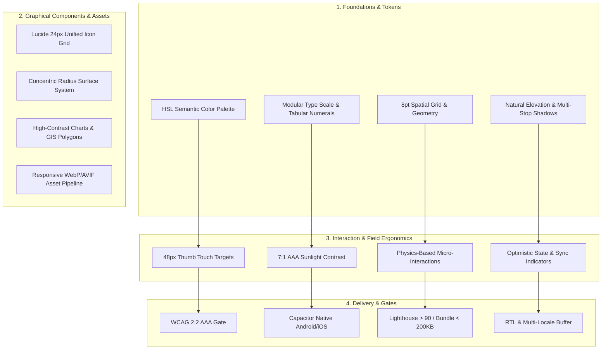

# Ag-Extension Platform: Frontend & Mobile Design Checklist

This document establishes the official **Graphical Design Standards, Visual System, Field Ergonomics, UX Architecture, Accessibility, and Performance Checklist** for the Ag-Extension Decision Support Platform (Web Dashboard, PWA, and Capacitor Mobile Application).

---

## 🎨 System Design Architecture & Graphical Pipeline



---

## 📋 Comprehensive Design & Graphical Standards Checklist

### 1. Graphical Design & Visual Identity Standards

| ID | Graphical Standard | Specification & Execution Details | Status |
| :--- | :--- | :--- | :---: |
| **GRP-01** | **Harmonious HSL Color Tokens** | **Base Semantic Colors:**<br>• **Brand Primary (Forest Emerald):** `hsl(160, 84%, 39%)` / `#059669`<br>• **Canvas Background (Light/Dark):** `#ffffff` / `#0c0a09` (`stone-950`)<br>• **Surface Card 1:** `#f8fafc` (`slate-50`) / `#1c1917` (`stone-900`)<br>• **Surface Card 2 (Modal):** `#ffffff` / `#292524` (`stone-800`)<br>• **Alert Amber (Pest/Risk):** `hsl(38, 92%, 50%)` / `#d97706`<br>• **Alert Crimson (Disease/Hazard):** `hsl(0, 84%, 60%)` / `#dc2626`<br>• **Water/Rainfall Sky:** `hsl(199, 89%, 48%)` / `#0284c7` | 🟢 Enforced |
| **GRP-02** | **Color Blindness Parity** | Data visualizations and status badges must never rely solely on color. Red/Green indicators must be accompanied by explicit text labels and distinct geometric icons (e.g. Checkmark for healthy, Exclamation Triangle for risk). | 🟢 Enforced |
| **GRP-03** | **Unified Typography Pairing** | • **Primary UI Typeface:** *Inter* / *Plus Jakarta Sans* (High x-height, open apertures for low-cost mobile screens).<br>• **Data & Numerical Typeface:** *JetBrains Mono* / *Roboto Mono* with `font-variant-numeric: tabular-nums` for crop yield, GPS coordinates, area, and financial alignment. | 🟢 Enforced |
| **GRP-04** | **Modular Type Hierarchy** | • **Display:** `36px` / `line-height: 44px` / `tracking: -0.02em`<br>• **H1 (Page Titles):** `30px` / `line-height: 36px` / `tracking: -0.02em`<br>• **H2 (Section Headers):** `24px` / `line-height: 32px` / `tracking: -0.015em`<br>• **H3 (Card Headers):** `20px` / `line-height: 28px` / `tracking: -0.01em`<br>• **Body Regular:** `16px` / `line-height: 24px` / `tracking: 0em`<br>• **Caption / Meta:** `14px` / `line-height: 20px` / `tracking: +0.01em`<br>• **Micro / Overline:** `12px` / `line-height: 16px` / `tracking: +0.05em` (uppercase). | 🟢 Enforced |
| **GRP-05** | **Micro-Typography Rules** | • Use non-breaking spaces before units: `120&nbsp;kg/ha`, `2.5&nbsp;ha`, `28&nbsp;°C`.<br>• Use true typographical quotes (`“ ”`) rather than straight quotes (`" "`).<br>• Use em-dashes (`—`) with standard spacing for parenthetical thought breaks. | 🟢 Enforced |
| **GRP-06** | **Unified 24px Icon Grid** | All icons (Lucide React) must render on a **24 × 24 px base grid** with a consistent **1.75px–2px stroke weight** (`stroke-linecap="round" stroke-linejoin="round"`). Icons must be optically centered to adjacent text baselines. | 🟢 Enforced |
| **GRP-07** | **8pt / 4pt Spatial Geometry** | All margins, paddings, gaps, and component heights must align with an **8pt hard grid** (sub-grid: **4pt**): `4px`, `8px`, `12px`, `16px`, `20px`, `24px`, `32px`, `40px`, `48px`, `64px`. | 🟢 Enforced |
| **GRP-08** | **Concentric Corner Radius Math** | Nested container radii must obey concentric geometry: $R_{\text{inner}} = R_{\text{outer}} - \text{padding}$.<br>• Outer Cards: `rounded-xl` (`12px`)<br>• Inner List Items / Inputs: `rounded-lg` (`8px`)<br>• Status Pills: `rounded-full` (`9999px`). | 🟢 Enforced |
| **GRP-09** | **Natural Multi-Stop Elevation Shadows** | Multi-layered ambient lighting shadows to eliminate muddy black halos:<br>• `shadow-sm`: `0 1px 2px 0 rgb(0 0 0 / 0.05)`<br>• `shadow-md`: `0 4px 6px -1px rgb(0 0 0 / 0.08), 0 2px 4px -2px rgb(0 0 0 / 0.04)`<br>• `shadow-lg`: `0 10px 15px -3px rgb(0 0 0 / 0.1), 0 4px 6px -4px rgb(0 0 0 / 0.05)`. | 🟢 Enforced |
| **GRP-10** | **GIS Map & Data Visualization Styling** | • **Field Polygons:** High-contrast `emerald-500` stroke (`2px`), `20%` semi-transparent emerald fill.<br>• **Pest/Disease Heatmaps:** Amber to Red radial gradients with clear step legends.<br>• **Chart Tooltips:** Frosted dark surface (`bg-stone-900/90 text-white`) with tabular metrics. | 🟢 Enforced |
| **GRP-11** | **Forbidden Cliché Tropes** | ❌ **No Purple-on-Dark:** Strictly prohibited purple/violet accents on dark backgrounds.<br>❌ **No Headline Biscuit Pills:** No pulsing dot pills directly above main headings.<br>❌ **No Gradient Keywords:** No CSS gradient text fills on headings.<br>❌ **No Icon Bento Bloat:** No grids packed with arbitrary disconnected icons.<br>❌ **No Over-Nested Cards:** Cards nested >2 levels deep are prohibited. | 🟢 Enforced |

---

### 2. Interactive States & Micro-Motion Matrix

| Interactive State | Visual Representation & Graphical Rule |
| :--- | :--- |
| **Default** | Crisp border (`border-stone-200 dark:border-stone-800`), semantic surface background, high-contrast text. |
| **Hover** | 1-step surface illumination (`hover:bg-stone-100 dark:hover:bg-stone-800`), subtle border darken, cursor pointer. |
| **Active / Pressed** | Slight physics scale down (`active:scale-[0.98]`), border tone shift for tangible tactile feedback. |
| **Focus-Visible** | High-visibility focus ring (`focus-visible:ring-2 focus-visible:ring-emerald-500 focus-visible:ring-offset-2`). |
| **Disabled** | Opacity reduced to `50%`, `cursor-not-allowed`, muted borders, no hover transitions. |
| **Loading / Skeleton** | Shimmer animation pulse with exact aspect ratio dimensions of the target content to eliminate CLS layout shift. |
| **Empty State** | Descriptive contextual graphic/illustration, clear explanation of why it is empty, and a prominent primary action button. |

**Motion Curves:** Transitions must use snappy spring-like cubic beziers: `cubic-bezier(0.16, 1, 0.3, 1)` with durations between **150ms–250ms**. Transitions must completely disable when `prefers-reduced-motion: reduce` is active.

---

### 3. Field Ergonomics & Touch Target Standards

| ID | Design Requirement | Specification & Verification | Status |
| :--- | :--- | :--- | :---: |
| **ERG-01** | **Minimum Touch Target Size** | All interactive elements must maintain a bounding box of at least **48 × 48 px** (`min-h-[48px] min-w-[48px]`). | 🟢 Required |
| **ERG-02** | **Thumb-Zone Optimization** | Primary actions (Log Visit, Scan Leaf, Save Record) must sit in the lower 35% of mobile screens (<640px). | 🟢 Required |
| **ERG-03** | **Touch Target Spacing** | Minimum **8px margin/gap** between adjacent buttons to prevent mis-taps while walking in fields. | 🟢 Required |
| **ERG-04** | **Virtual Keyboard Ergonomics** | Explicit `inputmode` attributes (`decimal`, `tel`, `numeric`) with automatic scroll-to-center to prevent keyboard obscuring inputs. | 🟢 Required |
| **ERG-05** | **Draft Auto-Save & Loss Prevention** | Forms continuously auto-save drafts to `localStorage` / `IndexedDB` on every keystroke. | 🟢 Required |

---

### 4. Sunlight Readability & Outdoor Visual UX

| ID | Design Requirement | Specification & Verification | Status |
| :--- | :--- | :--- | :---: |
| **SUN-01** | **Direct Sunlight Contrast (7:1)** | Body text must achieve at least **7:1 AAA contrast** against card and page backgrounds under direct glare. | 🟢 Required |
| **SUN-02** | **Anti-Glare Surface Depth** | Structured borders and subtle surface elevations rather than flat low-contrast grays that wash out outdoors. | 🟢 Required |
| **SUN-03** | **Large Typography for Key Metrics** | Primary field numbers (e.g. Soil Moisture %, Recommended NPK kg/ha) must render at minimum **24px–30px font-mono**. | 🟢 Required |

---

### 5. Mobile Shell, Safe Areas & Native Integration (Capacitor / PWA)

| ID | Design Requirement | Specification & Verification | Status |
| :--- | :--- | :--- | :---: |
| **MOB-01** | **Safe Area Insets** | Root layouts use `padding-top: env(safe-area-inset-top)` and `padding-bottom: env(safe-area-inset-bottom)` for camera notches and navigation bars. | 🟢 Required |
| **MOB-02** | **Status Bar & Theme Match** | Capacitor `StatusBar` matches page backgrounds (`#0c0a09` dark / `#ffffff` light). | 🟢 Required |
| **MOB-03** | **Pull-to-Refresh & Swipe Dismiss** | Native pull-to-refresh on dashboard lists; downward swipe drag-to-dismiss on bottom sheets. | 🟢 Required |
| **MOB-04** | **Camera & GPS Pre-Flight UX** | Friendly custom explainer modal before triggering OS camera (crop scanning) or GPS (field perimeter) permission requests. | 🟢 Required |
| **MOB-05** | **Offline Visual Sync Indicator** | Persistent, non-blocking floating pill showing pending offline sync records with manual "Sync Now" trigger. | 🟢 Required |

---

### 6. Responsiveness & Breakpoint Architecture

| ID | Breakpoint | Layout Behavior |
| :--- | :--- | :--- |
| **Compact Mobile** | `< 640px` (320px–639px) | Bottom thumb navigation bar, single-column full-width cards, full-screen bottom-sheet dialogs. |
| **Large Mobile / Foldable** | `640px – 767px` | 2-column metric cards, collapsible bottom sheets. |
| **Tablet** | `768px – 1023px` | Collapsible icon-rail side navigation, 2-to-3 column dashboard grid, centered modal dialogs. |
| **Desktop** | `1024px – 1439px` | Expandable sidebar navigation, multi-column analytics layouts, persistent secondary detail panels. |
| **Wide Desktop** | `≥ 1440px` | Max-content container bounds (`max-w-7xl` centered) with ample whitespace margins. |

---

### 7. Multilingual, Localization & Internationalization (i18n)

| ID | Design Requirement | Specification & Verification | Status |
| :--- | :--- | :--- | :---: |
| **LOC-01** | **Dynamic Text Expansion (40%)** | UI components must accommodate 40% text expansion (Swahili, French, German, Amharic) without breaking buttons or overlapping text. | 🟢 Required |
| **LOC-02** | **RTL Logical CSS Properties** | Use `ms-`, `me-`, `ps-`, `pe-`, `text-start`, `text-end` for seamless Arabic/Hausa bidirectional support. | 🟢 Required |
| **LOC-03** | **Localized Date & Time** | Standardized `Intl.DateTimeFormat` (e.g. `18 Aug 2026`) avoiding ambiguous slash dates. | 🟢 Required |
| **LOC-04** | **Metric / Imperial Unit Switch** | Instant one-tap toggle between Metric (kg, ha, °C) and Imperial (lbs, acres, °F). | 🟢 Required |

---

### 8. Accessibility & Performance Verification Gates

| ID | Standard / Metric | Requirement | Verification Method |
| :--- | :--- | :--- | :--- |
| **A11Y-01** | **WCAG 2.2 AA / AAA** | Zero contrast failures, all forms labelled, icon-only buttons with `aria-label`. | Vitest / Axe Core |
| **A11Y-02** | **Keyboard Operability** | Complete flow navigable via `Tab` / `Enter` / `Esc` with visible `ring-emerald-500`. | Manual & Playwright E2E |
| **A11Y-03** | **Screen Reader Announcements** | Live regions (`aria-live="polite"`) for async sync, chat, and validation errors. | Screen Reader Audit |
| **PERF-01** | **Bundle Budget** | Main JS chunk `< 200 KB` gzipped. | `npm run check:bundle` |
| **PERF-02** | **First Contentful Paint (FCP)** | `< 1.2s` on Fast 3G. | Lighthouse CI |
| **PERF-03** | **Cumulative Layout Shift (CLS)** | `< 0.05` (zero jumping elements). | Playwright E2E |

---

## 🧪 Verification Commands for Frontend & Mobile

```bash
# 1. Run bundle size and chunk budget checks
cd ag-extension-dashboard/src/frontend && npm run check:bundle

# 2. Run unit and accessibility tests
npm run test -- --run

# 3. Run Playwright release gates
npm run test:e2e -- --grep @release

# 4. Verify TypeScript and ESLint hygiene
npm run typecheck && npm run lint
```
