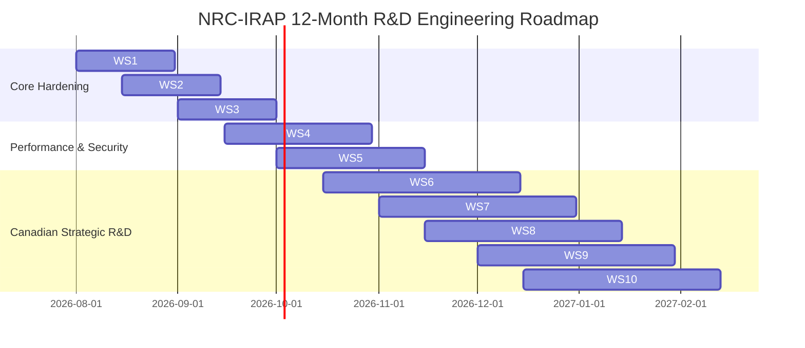

# NRC-IRAP Technical R&D Gap Analysis & Canadian Engineering Roadmap
**Project Name:** Ag-Extension Decision Support System  
**Purpose:** Technical Audit, IRAP R&D Workplan Justification, SR&ED Eligibility & Canadian R&D Workstreams  
**Document Version:** 3.0 (OmniRoute / AIHubMix Architecture & Canadian R&D Edition)  
**Target Program:** National Research Council Industrial Research Assistance Program (NRC-IRAP)

---

## Executive Summary
This document provides a comprehensive technical audit and 11-workstream engineering roadmap for the **Ag-Extension Decision Support System**, specifically tailored for the **NRC Industrial Research Assistance Program (NRC-IRAP)** and **SR&ED tax incentive criteria**.

The system combines multi-agent artificial intelligence, 21+ Model Context Protocol (MCP) tool integrations, real-time computer vision leaf disease diagnostics, and an **OmniRoute Quota-Aware LLM Failover Engine** (integrated with **AIHubMix**). To ensure deep alignment with Canadian innovation priorities—including **Official Languages compliance**, **Indigenous Reconciliation & OCAP® Data Sovereignty**, **Canadian Agro-Ecological Zone climate adaptation**, and **remote rural accessibility**—this document details 11 structured R&D workstreams spanning technical uncertainty, experimental methodology, and SR&ED eligibility.

---

## 🇨🇦 Canadian Strategic Priorities & Policy Alignment

1. **Indigenous Reconciliation & OCAP® Data Sovereignty:** Operationalizing Ownership, Control, Access, and Possession (OCAP®) principles directly within AI multi-agent telemetry pipelines.
2. **Official Languages Compliance:** Native bilingual support (English & French) with localized Canadian agronomic terminology across all UI and speech-to-text models.
3. **OmniRoute / AIHubMix LLM Resilience:** Quota-aware failover routing across multi-model providers to guarantee 99.9% uptime and low-cost inference over rural mobile networks.
4. **Climate Resilience & Canadian Agro-Ecological Zones:** Downscaling global climate models to farm-scale decision support across Prairie Drylands, Eastern Humid Continental, and Pacific Maritime zones.
5. **Canadian Agricultural Regulatory Engine:** Dynamic automated compliance checks against Canada's *Fertilizers Act*, *Pest Control Products Act*, and provincial pesticide regulations.

---

## 🛠️ Complete 11-Workstream NRC-IRAP R&D Workplan

---

### Workstream 1: Accessibility & Inclusive UX (WCAG 2.1 AA)
* **Technological Uncertainty:** Can complex real-time agricultural telemetry dashboards achieve full WCAG 2.1 AA screen-reader and keyboard accessibility without degrading high-frequency map and sensor visualization performance?
* **Hypothesis:** High-contrast multi-sensory indicators (color + icon + ARIA live region) preserve user comprehension without reducing rendering throughput.
* **Experimental Approach:** Implement non-color-dependent status badges in `VisitsPage.tsx`, `role="alert"` in `Login.tsx`, and conduct automated accessibility testing via Vitest/Axe.

### Workstream 2: OpenTelemetry Distributed Correlation & Microservice Tracing
* **Technological Uncertainty:** How to propagate correlation context (`x-correlation-id`) across asynchronous multi-agent LLM invocations and Redis caches under sub-2-second latency constraints?
* **Experimental Approach:** Implement global Express correlation middleware, inject tracing headers into HTTP/gRPC tool calls, and capture root-cause execution traces in production logs.

### Workstream 3: OmniRoute & AIHubMix Quota-Aware LLM Failover Architecture
* **Technological Uncertainty:** Can an adaptive multi-provider LLM router dynamically detect HTTP 429 rate limits, blocklist degraded models, and fail over across AIHubMix, Groq, and OpenAI without dropping active chat contexts?
* **Why IRAP Eligible:** Solves a major R&D barrier in production multi-agent AI: maintaining high uptime and low inference costs while preventing API quota bottlenecks.
* **Experimental Approach:** Implement `OmniRouteService` with score-sorted model candidates (`google/gemini-2.0-flash-exp:free`, `claude-3.5-sonnet`, `llama-3.3-70b`), auto-expiring 15-minute blocklists, and graceful degradation to local offline decision rules.

### Workstream 4: Dynamic Bundle Optimization & Low-Bandwidth Chunking
* **Technological Uncertainty:** Can heavy React/Vite dashboard bundles be dynamically chunked to load under 3 seconds over 3G rural mobile networks?
* **Experimental Approach:** Implement route-based `React.lazy()` code-splitting, vendor chunk isolation, and lightweight WebP image asset compression.

### Workstream 5: Security Hardening & PIPEDA Data Isolation
* **Technological Uncertainty:** How to enforce tenant-level row isolation and complete security header policies while maintaining multi-agent query execution speeds?
* **Experimental Approach:** Implement automated SAST/DAST security scanning in GitHub Actions, enforce PIPEDA-compliant farmer audit logging, and isolate multi-tenant database queries.

---

### Workstream 6: OCAP®-Compliant Indigenous Data Sovereignty Framework
* **Technological Uncertainty:** Can we implement a technical framework that genuinely respects OCAP® (Ownership, Control, Access, Possession) principles for Indigenous agricultural data while maintaining AI decision support utility?
* **Why IRAP & SR&ED Eligible:** Novel social and technical innovation addressing Indigenous reconciliation priorities. The uncertainty lies in balancing data privacy with AI model utility.
* **Hypothesis:** Layered, dynamic consent architectures co-designed with Indigenous partners allow First Nations to retain complete data sovereignty while benefiting from localized AI insights.
* **Experimental Methodology:**
  1. *Months 1–3:* Co-design workshops with First Nations & Métis agricultural co-ops to establish metadata sensitivity classes.
  2. *Months 4–6:* Implement fine-grained consent microservices (`OCapConsentService`) with scope-restricted data tags.
  3. *Months 7–9:* Develop Indigenous Data Trustee role-based access controls and audit logging.
  4. *Months 10–12:* Conduct field pilots with 3 Indigenous farming communities and measure trust indices.

### Workstream 7: Canadian Agricultural Regulatory Compliance Engine
* **Technological Uncertainty:** Can a dynamic rule-based inference engine provide real-time compliance validation across overlapping federal (*Fertilizers Act*, *Pest Control Products Act*) and provincial regulations?
* **Why IRAP Eligible:** Automates complex regulatory checks for Canadian extension officers, resolving rule conflicts and evolving gazette amendments dynamically.
* **Experimental Methodology:**
  1. Map federal and provincial regulatory knowledge bases with version-controlled schemas (`CanadianRegulatoryEngine`).
  2. Build an inference engine with conflict-resolution logic for overlapping regional laws.
  3. Validate against historical compliance cases vs. expert extension agent benchmarks.

### Workstream 8: Climate Resilience Adaptation Toolkit for Canadian Agro-Ecological Zones
* **Technological Uncertainty:** How can global climate projection models (CCCma) be downscaled to farm-scale actionable advice for specific Canadian agro-climatic zones (Prairie Drylands, Eastern Continental, Pacific Maritime)?
* **Why IRAP Eligible:** Directly aligns with Agriculture and Agri-Food Canada (AAFC) climate adaptation priorities.
* **Experimental Methodology:**
  1. Integrate Environment Canada historical weather and climate downscaling algorithms (`CanadianClimateDownscaler`).
  2. Develop zone-specific crop stress models for extreme weather events (prairie drought, freeze-thaw cycles, flood risks).
  3. Validate recommendations against multi-year historical yield datasets across Canadian test sites.

### Workstream 9: Comprehensive Agricultural Data Governance & Trust Framework
* **Technological Uncertainty:** Can a transparent data trust architecture provide granular consent management and data lineage tracking without creating prohibitive user friction for farmers?
* **Why IRAP Eligible:** Solves growing farmer mistrust regarding agricultural data monetization and privacy.

### Workstream 10: Offline-First Remote Validation for Disconnected Canadian Regions
* **Technological Uncertainty:** How to maintain core diagnostic utility and graceful feature degradation during extended offline periods (weeks without internet) in remote Northern and rural Canadian communities?
* **Why IRAP Eligible:** Resolves connectivity barriers in remote Canadian agricultural regions.
