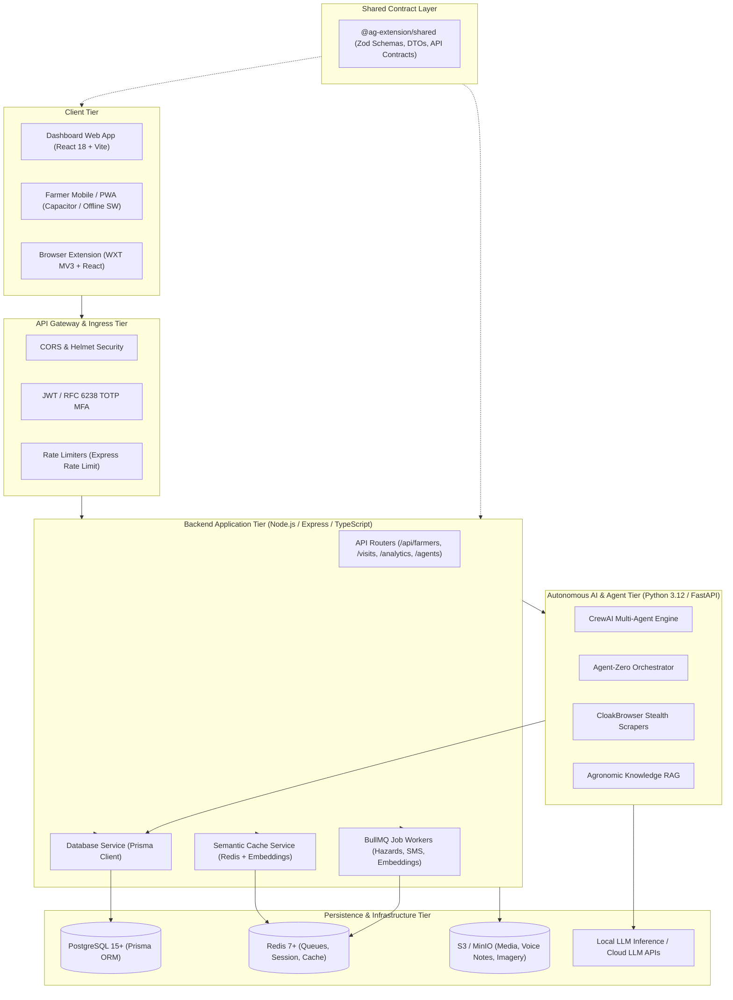
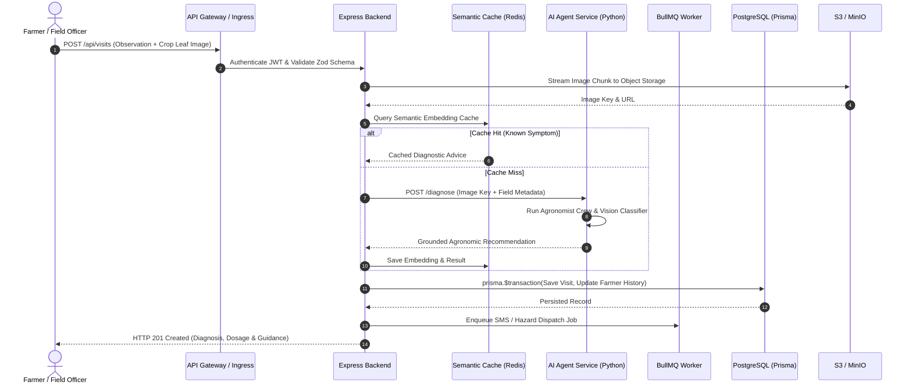
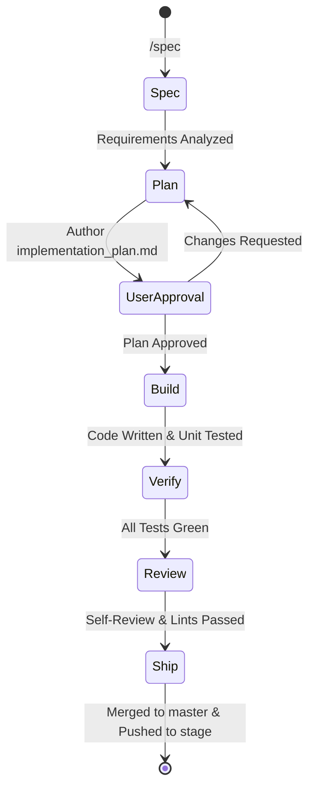

# Agri-Extension Decision Support Platform — Software Architecture & Life Cycle Guide

> **Canonical System Specification & Engineering Life Cycle Manual**  
> **Repository**: `ag_extension_decision_support`  
> **Status**: Active / Production Architecture  
> **Version**: 2.0.0  

---

## Table of Contents
1. [Executive Summary & System Purpose](#1-executive-summary--system-purpose)
2. [High-Level Architecture & Component Topology](#2-high-level-architecture--component-topology)
3. [Subsystem Specifications](#3-subsystem-specifications)
4. [Strategic Architecture Pillars](#4-strategic-architecture-pillars)
5. [Runtime Data Flow & Processing Lifecycle](#5-runtime-data-flow--processing-lifecycle)
6. [Software Development Life Cycle (SDLC) & Engineering Workflow](#6-software-development-life-cycle-sdlc--engineering-workflow)
7. [CI/CD, Release & Deployment Lifecycle](#7-cicd-release--deployment-lifecycle)
8. [Cross-Cutting Governance & Protocols](#8-cross-cutting-governance--protocols)

---

## 1. Executive Summary & System Purpose

The **Agri-Extension Decision Support Platform** is an enterprise-grade, multi-tier agricultural intelligence system designed to empower smallholder farmers, field extension officers, agronomists, and agribusinesses across developing and emerging agricultural markets.

```
┌────────────────────────────────────────────────────────────────────────────────────────┐
│                        AGRI-EXTENSION DECISION SUPPORT PLATFORM                        │
└────────────────────────────────────────────────────────────────────────────────────────┘
            │                                     │                              │
            ▼                                     ▼                              ▼
  [Smallholder Farmers]               [Extension Agents & Officers]      [Enterprise & Admins]
  • Multilingual Voice Notes (Whisper) • Field Diagnosis & Polygon GPS    • Regional Anomaly Maps
  • SMS / WhatsApp Advisories         • Offline Edge Record Sync         • Carbon Credit Auditing
  • Agrochemical Dosage Calculators   • Farmer Profiling & Visit Logs    • Agrodealer Directory
```

### Core Problems Solved:
- **Last-Mile Knowledge Gap**: Delivers scientifically validated, localized agronomic recommendations directly to rural farmers regardless of literacy or language (via voice IVR and WhatsApp).
- **Intermittent Connectivity**: Equips field agents with offline-first Progressive Web Apps (PWAs) capable of capturing GIS field polygons and leaf diagnostic imagery without cellular reception.
- **Economic & Environmental Integrity**: Connects farmers with certified agro-dealers, calculates Benefit-Cost Ratios (BCR) for fertilizer inputs, and models Soil Organic Carbon (SOC) sequestration under IPCC Tier 2 standards.

---

## 2. High-Level Architecture & Component Topology



---

## 3. Subsystem Specifications

### 3.1 Client Tier
* **Dashboard Frontend** ([`ag-extension-dashboard/src/frontend`](file:///home/psalmprax/ALL_PROJECTS/ag_extension_decision_support/ag-extension-dashboard/src/frontend)):
  * **Stack**: React 18, Vite 5, Tailwind CSS, TanStack Query, Lucide Icons, Recharts.
  * **Role**: Administrative control plane, GIS parcel visualization, real-time alert dispatch console, and telemetry dashboards.
* **Mobile / PWA Client** ([`ag-extension-dashboard/src/frontend/ios`](file:///home/psalmprax/ALL_PROJECTS/ag_extension_decision_support/ag-extension-dashboard/src/frontend/ios)):
  * **Stack**: Capacitor runtime with Service Worker background synchronization.
  * **Role**: Zero-connectivity field operations for field officers. Caches farmer profiles, offline visits, and polygon GPS tracks in local IndexedDB.
* **Browser Extension** ([`ag-extension-browser-ext`](file:///home/psalmprax/ALL_PROJECTS/ag_extension_decision_support/ag-extension-browser-ext)):
  * **Stack**: WXT framework, Manifest V3, React, Tailwind CSS.
  * **Role**: Contextual agricultural assistant embedded within extension web portals and commodity market sites.

### 3.2 Backend Service Tier
* **Location**: [`ag-extension-dashboard/src/backend`](file:///home/psalmprax/ALL_PROJECTS/ag_extension_decision_support/ag-extension-dashboard/src/backend)
* **Stack**: Node.js 20+, TypeScript, Express.js, Prisma ORM, BullMQ, Redis, Winston, OpenTelemetry.
* **Responsibilities**:
  * Authentication, session lifecycle, and RFC 6238 TOTP MFA.
  * Business logic execution for field visits, diagnostic reviews, and farmer profiles.
  * BullMQ asynchronous worker dispatch for weather anomaly scanning and hazard broadcasts.
  * Media streaming and presigned URL generation for audio and image storage.

### 3.3 Autonomous AI & Agent Tier
* **Location**: [`ag-extension-dashboard/src/agents`](file:///home/psalmprax/ALL_PROJECTS/ag_extension_decision_support/ag-extension-dashboard/src/agents)
* **Stack**: Python 3.12, FastAPI, CrewAI, LangChain, Pydantic, CloakBrowser.
* **Specialized Agent Roles**:
  * **Agronomist Agent**: Analyzes pest/disease symptoms, cross-referencing regional crop disease databases.
  * **Climate & Hazard Agent**: Ingests NOAA/Open-Meteo feeds, identifies 48h weather anomalies, and calculates frost/drought severity.
  * **Market Intelligence Agent**: Scrapes and synthesizes regional commodity spot prices and fertilizer market rates.
  * **CloakBrowser Engine**: Employs headless browser profiles to monitor agricultural pricing portals without triggering bot defenses.

### 3.4 Shared Contract Layer
* **Location**: [`ag-extension-shared`](file:///home/psalmprax/ALL_PROJECTS/ag_extension_decision_support/ag-extension-shared)
* **Role**: Single source of truth (`@ag-extension/shared`) for TypeScript types, API response interfaces, WebSocket message shapes, and Zod validation schemas. Synced with backend and extension via `npm run shared:sync`.

---

## 4. Strategic Architecture Pillars

Detailed in [`ARCHITECTURE_PILLARS.md`](file:///home/psalmprax/ALL_PROJECTS/ag_extension_decision_support/ARCHITECTURE_PILLARS.md):

```
┌───────────────────┬───────────────────┬───────────────────┬───────────────────┬───────────────────┬───────────────────┐
│ 1. Security &     │ 2. Zero-Conn      │ 3. Voice &        │ 4. Economic       │ 5. Agronomic      │ 6. Automated      │
│    Identity       │    Field Edge     │    Inclusivity    │    Supply Loop    │    ROI & Carbon   │    Hazard Engine  │
├───────────────────┼───────────────────┼───────────────────┼───────────────────┼───────────────────┼───────────────────┤
│ • RFC 6238 TOTP   │ • Offline SQLite/ │ • WhatsApp Voice  │ • Certified Agro- │ • Yield Gain Diff │ • 48h Anomaly     │
│ • Lockout Gates   │   IndexedDB Queue │   Note Ingestion  │   Dealer Network  │ • Input BCR Model │   Forecast Scans  │
│ • SHA-256 Session │ • WGS-84 Polygon  │ • Whisper STT     │ • QR Batch Anti-  │ • IPCC Tier 2     │ • Geo-Targeted    │
│ • GeoIP & Audit   │   Acreage Measure │ • Twilio/AT IVR   │   Fraud Ledger    │   SOC Soil Carbon │   Broadcast Queue │
└───────────────────┴───────────────────┴───────────────────┴───────────────────┴───────────────────┴───────────────────┘
```

1. **Security & Identity**: Enforces strict audit trails (`login_history` table), rate limits, IP velocity detection, and cryptographically verified sessions.
2. **Zero-Conn Field Edge**: Enables field officers to map parcel perimeters via WGS-84 coordinate polylines and record diagnostics completely offline, auto-replaying upon network reconnection.
3. **Voice & Inclusivity**: Bridges the rural literacy barrier through multi-lingual voice recognition (Whisper) and DTMF-guided IVR menus.
4. **Economic Supply Loop**: Combats counterfeit inputs through cryptographic batch verification and maps vetted agrochemical providers.
5. **Agronomic ROI & Carbon**: Models empirical fertilizer response curves and calculates soil carbon sequestration for international verification credits.
6. **Automated Hazard Engine**: Continuously polls geospatial meteorological models to trigger pre-emptive alerts for extreme frosts, flash floods, or locust invasions.

---

## 5. Runtime Data Flow & Processing Lifecycle



---

## 6. Software Development Life Cycle (SDLC) & Engineering Workflow

In alignment with [`CLAUDE.md`](file:///home/psalmprax/ALL_PROJECTS/ag_extension_decision_support/CLAUDE.md) and [`KARPATHY_RULES.md`](file:///home/psalmprax/ALL_PROJECTS/ag_extension_decision_support/KARPATHY_RULES.md), all engineering tasks strictly adhere to the sequential 6-phase development lifecycle:



### Phase 1: Define (`/spec`)
* Analyze feature requirements, identify impacted systems across frontend, backend, agents, or shared libraries.
* Define real-world agricultural domain constraints and data boundaries.

### Phase 2: Plan (`/plan`)
* Author an `implementation_plan.md` specifying:
  * Exact files to create or modify.
  * Database migrations or schema alterations required.
  * Comprehensive verification and test strategy.
* **Stop & Obtain User Approval** before touching production code.

### Phase 3: Build (`/build`)
* Implement surgical, clean, modular code.
* Follow the DRY principle and decompose any component exceeding 300 lines.
* **No Placeholders**: Zero `TODO`, `FIXME`, dummy stubs, or synthetic `{ success: true }` mocks.

### Phase 4: Verify (`/test`)
* Execute the strict test and verification pipeline:
  ```bash
  # Shared contract integrity
  npm run shared:check

  # Full linting
  npm run lint

  # Backend & Frontend Unit/Integration suites
  npm run test:backend
  npm run test:frontend

  # Browser extension tests
  cd ag-extension-browser-ext && npm test && cd ..

  # Agent & Security gates
  npm run security:test

  # Dead code fallow check
  npm run fallow:check

  # Anti-Flop & Anti-Hallucination automated gates
  npm run verify:anti
  ```

### Phase 5: Review (`/review`)
* Perform diff self-review.
* Audit console outputs, sanitize raw user inputs, and verify accessibility (WCAG 2.1 AA).
* Verify zero regressions against the baseline.

### Phase 6: Ship (`/ship`)
* Present concise walkthrough of changes.
* Execute Git hygiene workflow (see [Section 7](#7-cicd-release--deployment-lifecycle)).

---

## 7. CI/CD, Release & Deployment Lifecycle

### 7.1 Git Branching & Merging Strategy
1. **Local Development**: All feature work and bug fixes occur exclusively on the local `stage` branch.
2. **Local Merging**: Upon passing all Phase 4 verification gates, the local `stage` branch is merged into the local `master` branch.
3. **Remote Deployment**: Pushes are dispatched **ONLY** to the remote `stage` branch on GitHub:
   ```bash
   git push origin stage
   ```
   *Direct pushes to remote `master` are strictly disallowed.*

### 7.2 Container & Deployment Operations
Detailed in [`docs/PRODUCTION_DEPLOYMENT_GUIDE.md`](file:///home/psalmprax/ALL_PROJECTS/ag_extension_decision_support/docs/PRODUCTION_DEPLOYMENT_GUIDE.md):

* **Container Recreation Safety**: Always run `docker compose down --remove-orphans` prior to restarting services to prevent orphaned network collisions.
* **Shared Network Pre-Creation**: Compose external networks (`ag-network`) must be pre-created before container startup:
  ```bash
  docker network create --driver bridge ag-network || true
  ```
* **Local Buildx Cache**: To bypass registry rate limits, container builds export layer caches to a local host directory (`--allow=fs=/root`).
* **Dynamic Database Migrations**: Pipeline checks schema drift using `npm run check:drift` and automatically resolves non-breaking migration queue locks.

---

## 8. Cross-Cutting Governance & Protocols

The system enforces three primary operational protocols:

1. **[`anti_flop.md`](file:///home/psalmprax/ALL_PROJECTS/ag_extension_decision_support/anti_flop.md) (`AG-SKILL-AF-01`)**:
   * Enforces zero regressions, eradication of dead stubs, offline graceful degradation, bounded memory usage for media streaming, and 100% CI green compliance.
   * Automated verification: `npm run verify:anti-flop`.

2. **[`anti_hullicination.md`](file:///home/psalmprax/ALL_PROJECTS/ag_extension_decision_support/anti_hullicination.md) (`AG-SKILL-AH-01`)**:
   * Enforces epistemic grounding: inspect source before asserting facts, reject uninstalled dependencies, prevent hallucinated agrochemical dosages or fake AI capabilities, and respect Prisma schema sovereignty.
   * Automated verification: `npm run verify:anti-hallucination`.

3. **[`KARPATHY_RULES.md`](file:///home/psalmprax/ALL_PROJECTS/ag_extension_decision_support/KARPATHY_RULES.md)**:
   * **Think before coding**: Deeply understand context, schemas, and data flow.
   * **Simplicity first**: Prefer concrete, flat architectures over unnecessary abstractions.
   * **Surgical changes only**: Never touch unrelated files or refactor outside the assigned goal.
   * **Domain fidelity**: Maintain absolute integrity in agricultural datasets and real-world API integrations.
