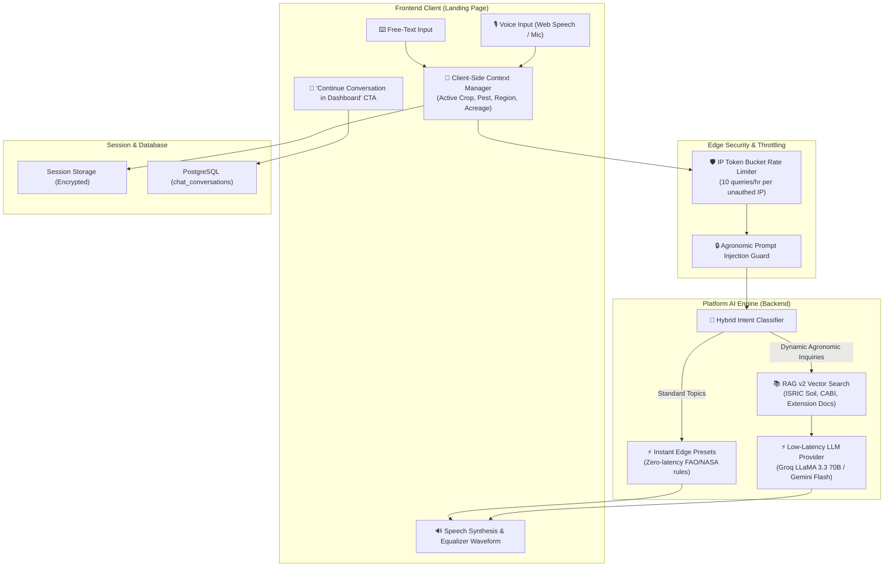
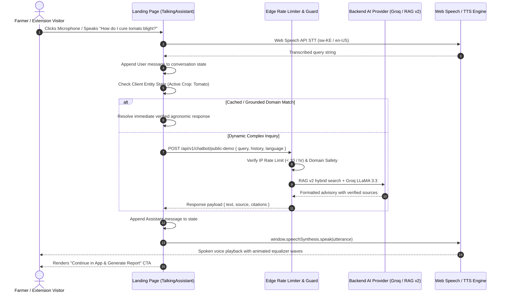

# Specification: Talking Assistant Conversational AI Enhancement (Phase 2.3)

**Status:** Proposed Architecture & Engineering Specification  
**Classification:** Public Landing Page & Client Experience / Core Agronomic AI  
**Target Audience:** Prospective Clients, Smallholder Farmers, Extension Officers, Platform Agronomists  
**Related Documents:**
- [`docs/specs/PHASE2-VOICE-ADVISING-STT.md`](file:///home/psalmprax/ALL_PROJECTS/ag_extension_decision_support/docs/specs/PHASE2-VOICE-ADVISING-STT.md)
- [`docs/ag-extension-dashboard-architecture.md`](file:///home/psalmprax/ALL_PROJECTS/ag_extension_decision_support/docs/ag-extension-dashboard-architecture.md)
- [`docs/CYBERSECURITY_PLAYBOOK.md`](file:///home/psalmprax/ALL_PROJECTS/ag_extension_decision_support/docs/CYBERSECURITY_PLAYBOOK.md)

---

## 1. Executive Summary & Vision

The **Talking Assistant** deployed on the platform landing page ([`TalkingAssistant.tsx`](file:///home/psalmprax/ALL_PROJECTS/ag_extension_decision_support/ag-extension-dashboard/src/frontend/src/pages/landing/sections/TalkingAssistant.tsx)) demonstrates the platform's voice intelligence and agronomic decision engine. 

To maximize client engagement, conversion, and advisory value, this enhancement upgrades the assistant from a single-turn demonstration into a **fully interactive, multi-turn conversational AI companion**. Prospective clients and smallholder farmers can conduct a natural spoken or typed dialogue with context continuity, receive grounded agronomic diagnoses, explore agricultural market data, and seamlessly transition their conversation directly into the authenticated platform upon registration.

---

## 2. Architectural Pillars of the Enhancement

---

### Pillar 1: Multi-Turn Contextual Dialogue Engine

Currently, client interactions resolve queries independently. The conversational enhancement introduces stateful context tracking across turns:

1. **Agronomic Entity Slots**:
   - `crop`: e.g., Maize, Cassava, Tomato, Sorghum, Coffee.
   - `pest_disease`: e.g., Fall Armyworm, Tomato Blight, Aphids.
   - `location_climate`: e.g., Rift Valley, semi-arid, high rainfall.
   - `field_size`: e.g., 2 acres, 0.5 hectares.
   - `soil_profile`: e.g., Acidic pH 4.8, sandy loam.

2. **Anaphora Resolution**:
   - *Turn 1 (Client)*: "My maize leaves have yellow spots and ragged holes."
   - *Turn 1 (Assistant)*: "That sounds like Fall Armyworm damage. Scouting at dusk and applying Neem oil or Bt is recommended."
   - *Turn 2 (Client)*: "What dosage should I use for 3 acres?"
   - *Turn 2 (Assistant)*: *(Resolves context: Crop=Maize, Target=Fall Armyworm, Area=3 acres)* "For 3 acres of maize, mix 1.2 liters of Neem oil (at 3ml/L water rate across 400L total spray volume) applied directly into the central leaf whorls."

---

### Pillar 2: Hybrid Edge & Rate-Limited Public Demo API

To balance real-time responsiveness with infrastructure protection and zero token-budget exhaustion:

1. **Tier 1: Instant Client-Side Rules (0ms Latency)**
   - Common queries (Armyworm, soil pH, satellite SPEI, offline security) resolve immediately via local agronomic knowledge graphs, requiring zero backend roundtrips.
2. **Tier 2: Public Demo Endpoint (`POST /api/v1/chatbot/public-demo`)**
   - For novel, unlisted agronomic questions, the frontend calls a public, rate-limited endpoint.
   - **Rate Limiting**: 10 queries per rolling 60-minute window per IP (enforced via Redis sliding-window algorithm).
   - **Safety Filter**: System prompts enforce strict agricultural domain boundaries—prompt injections, system prompt extraction, or non-agronomic coding/math requests are gracefully declined with: *"I am specialized in agricultural extension and crop health. How can I assist with your farm or crops?"*
   - **Provider**: Ultra-low latency inference via **Groq LLaMA 3.3 70B** ($< 400\text{ms}$ time-to-first-token) to keep conversational voice snappy and natural.

---

### Pillar 3: Inclusive Multilingual Voice Engine

1. **Enhanced Dialect Recognition**:
   - Support for **English** (`en-US`, African-accented English) and **Kiswahili** (`sw-KE`).
   - Integrated acoustic biasing for agricultural terms:
     - Swahili: *vunguvungu*, *funza*, *ukungu*, *chokaa ya kilimo*, *matandazo*, *mbolea ya samadi*.
     - English: *Azadirachtin*, *Bacillus thuringiensis*, *NPK 17:17:17*, *SPEI drought index*.
2. **Graceful Fallback Matrix**:
   - If browser Web Speech API is unavailable (e.g., Firefox on Linux or embedded mobile webview), seamless fallback to Web Audio API recording $\rightarrow$ `/api/v1/chatbot/speech-to-text` (Whisper/SALT provider).
   - Real-time text fallback always displayed synchronously with audio playback.

---

### Pillar 4: Frictionless Onboarding & Session Handoff

A critical goal of the landing page assistant is converting curious farmers and extension managers into registered platform users without losing their dialogue:

1. **In-Session Handoff Banner**:
   - When the conversation reaches 3+ turns, a non-intrusive action card appears:
     > *"Save this diagnostic advisory and generate an official Field Visit Report. **Sign up for free**"*.
2. **Cryptographic Conversation State Preservation**:
   - The active message thread and identified farm entities are serialized and preserved in client-side encrypted storage (`sessionStorage` / AES-256).
3. **Post-Registration Ingestion**:
   - Upon registration or login, the dashboard automatically imports the landing page session into the user's permanent [`FarmerChatPage`](file:///home/psalmprax/ALL_PROJECTS/ag_extension_decision_support/ag-extension-dashboard/src/frontend/src/pages/FarmerChatPage.tsx) history, assigning a unique `conversation_id`.

---

## 3. Data Flow & Interaction Sequence

---

## 4. Security, Non-Repudiation & Privacy

1. **Zero Raw Audio Storage on Public Tier**:
   - For unauthenticated landing page visitors, microphone speech recognition is processed purely on-device via browser Web Speech APIs. No raw voice audio is saved or transmitted to third-party databases.
2. **Ephemeral Context**:
   - Unauthenticated conversation states live strictly within the client's browser memory until explicitly handed off through authenticated sign-up.
3. **Strict Domain Guardrails**:
   - The public LLM prompt boundary prevents non-agricultural computation, ensuring zero exposure to prompt extraction or reputational abuse.

---

## 5. Implementation Roadmap

| Milestone | Deliverables | Target Gate |
| :--- | :--- | :--- |
| **Phase 2.3.1** | Slot extraction & client-side multi-turn context tracking in [`TalkingAssistant.tsx`](file:///home/psalmprax/ALL_PROJECTS/ag_extension_decision_support/ag-extension-dashboard/src/frontend/src/pages/landing/sections/TalkingAssistant.tsx) | Vitest component unit tests |
| **Phase 2.3.2** | Public demo endpoint `POST /api/v1/chatbot/public-demo` with Redis sliding-window rate limiting | Jest backend tests & security test |
| **Phase 2.3.3** | Fallback server-side Whisper transcription for browsers lacking Web Speech API | Cross-browser compatibility tests |
| **Phase 2.3.4** | "Save to Dashboard" session handoff integrating with registration workflow | Playwright E2E signup-to-chat flow |
