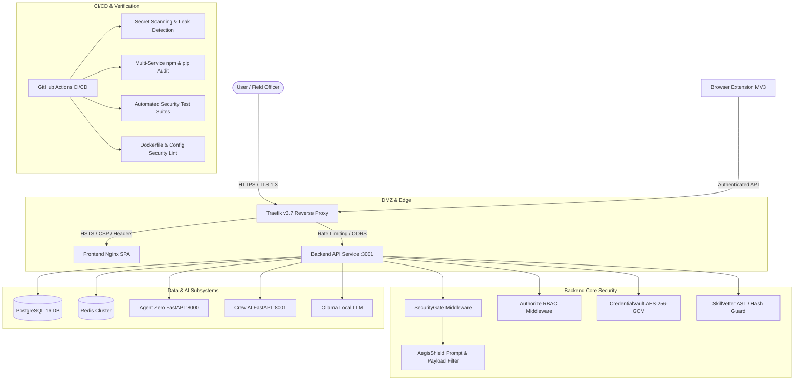

# Implementation Plan: Full-Spectrum Cybersecurity Protocol Checklist, Test Suites & CI/CD Integration

## 1. Executive Summary & Objective

The objective is to establish an enterprise-grade cybersecurity posture and continuous verification framework across all services in the Ag-Extension Decision Support platform. This includes:
1. A formalized, actionable **Cybersecurity Protocol Checklist** (`docs/CYBERSECURITY_CHECKLIST.md`) adhering to OWASP Top 10, OWASP Top 10 for LLM Applications, CIS Benchmarks, and ISO 27001 / SOC 2 controls.
2. Automated **Security Test Suites** validating defense-in-depth across Backend, Frontend, AI Agents, Browser Extension, and Shared Packages.
3. Automated **CI/CD Security Pipelines** (GitHub Actions `.github/workflows/security-audit.yml` and upgraded `.github/workflows/ci-cd.yml`) and local developer tooling (`scripts/security-audit.sh`, `npm run security:*`).

---

## 2. Architecture & Service Scope

---

## 3. Proposed Deliverables

### Phase 1: Comprehensive Cybersecurity Protocol Checklist
- **File**: `docs/CYBERSECURITY_CHECKLIST.md`
- **Coverage**:
  - **Section 1: Authentication & Access Control (IAM & RBAC)**
    - JWT signature verification with cryptographic algorithms (`HS256`/`RS256`).
    - Privilege escalation defense (blocking self-registration for `ADMIN` role).
    - Session lifetime, refresh token rotation, and revocation.
    - Multi-tenant tenant ID isolation and parameterized queries.
  - **Section 2: Cryptography & Secrets Management**
    - `CredentialVault` AES-256-GCM symmetric encryption for external API tokens with IV and AuthTag validation.
    - Persistent `CREDENTIAL_ENCRYPTION_KEY` requirement in production environments.
    - Automated credential rotation and expiration tracking.
    - Zero plaintext credentials or hardcoded keys in repository.
  - **Section 3: Application Security & Defense-in-Depth (OWASP Top 10)**
    - `AegisShield` real-time request sanitization (SQLi, XSS, SSRF, command injection, Unicode obfuscation).
    - Strict input validation with schemas on all routes.
    - Centralized error handling masking internal stack traces and database error codes.
    - Rate limiting per IP and per authenticated user.
    - Security headers (HSTS, CSP, X-Frame-Options, X-Content-Type-Options, Permissions-Policy).
  - **Section 4: AI / LLM & Agent Security (OWASP Top 10 for LLM)**
    - Prompt injection neutralization (`AegisShield.buildProtectedSystemPrompt` & pattern filters).
    - `SkillVetter` code analysis (eval, child_process, network exfiltration, prototype pollution).
    - Blocked hash registry for untrusted tools and packages.
    - Token quota & budget controls (`apiBudgetTool`).
  - **Section 5: Browser Extension Security (Manifest V3)**
    - Least-privilege permissions model.
    - Strict Content Security Policy (no inline eval, isolated background service worker).
    - Validated messaging channels between content scripts and background worker.
  - **Section 6: Container & Infrastructure Hardening**
    - Non-root user execution in all Docker containers.
    - Minimal slim/alpine base images to reduce attack surface.
    - Network isolation via internal Docker bridge networks (`ag-network`).
    - Read-only root filesystems and tmpfs where applicable.
  - **Section 7: Supply Chain & Dependency Governance**
    - Automated `npm audit` and `pip-audit` vulnerability gates.
    - Lockfile immutability checks (`npm ci`).
  - **Section 8: Incident Response, Audit & Observability**
    - Correlation IDs (`X-Correlation-ID`) across requests.
    - Audit logging (`auditMiddleware`) with PII/secret scrubbing.

---

### Phase 2: Automated Multi-Service Security Test Suites

#### 1. Backend Security Tests
- `ag-extension-dashboard/src/backend/src/__tests__/security.aegisShield.test.ts`:
  - System prompt override attempt detection & blocking.
  - SQL injection syntax detection (`DROP`, `DELETE`, `; --`).
  - XSS script payload detection (`<script>`, `javascript:`, event handlers).
  - Invisible Unicode obfuscation and zero-width character stripping.
  - Tool output sanitization and system prompt wrapping.
- `ag-extension-dashboard/src/backend/src/__tests__/security.credentialVault.test.ts`:
  - AES-256-GCM roundtrip encryption/decryption with valid auth tags.
  - Tamper detection / decryption failure on corrupted ciphertext or auth tags.
  - Credential rotation and expiration verification.
  - Revocation and access audit logging.
- `ag-extension-dashboard/src/backend/src/__tests__/security.skillVetter.test.ts`:
  - Detection of malicious patterns (`eval`, `Function`, `child_process`, `__proto__`, `process.exit`).
  - Untrusted origin score penalization.
  - Excessive permission flags (`filesystem:write:all`, `shell:unrestricted`).
  - Known vulnerable dependency identification.
  - Blocked hash enforcement.
- `ag-extension-dashboard/src/backend/src/__tests__/security.gateAndAuth.test.ts`:
  - `securityGate` blocking threat payloads in query parameters and JSON bodies with HTTP 403.
  - `authorize` middleware enforcing role checks (e.g. `ADMIN` vs `OFFICER` vs `FARMER`).
  - Auth route rejecting self-registration with `role: 'ADMIN'`.

#### 2. Frontend Security Tests
- `ag-extension-dashboard/src/frontend/src/__tests__/securityPolicy.test.ts`:
  - Content Security Policy header verification.
  - Sanitization of user-provided content before rendering.
  - Token handling in client-side storage (clearing on logout, no sensitive data leaks).

#### 3. AI Agents Security Tests
- `ag-extension-dashboard/src/agents/tests/test_security.py`:
  - FastAPI authentication token requirements.
  - CORS header restrictions (ensuring non-wildcard with credentials).
  - Payload sanitization and error masking.

#### 4. Browser Extension Security Tests
- `ag-extension-browser-ext/tests/manifest-security.test.ts`:
  - Manifest V3 structure verification.
  - Restriction of dangerous permissions and CSP verification.

---

### Phase 3: CI/CD Security Pipelines & Developer Tooling

1. **Local Developer Security Runner**:
   - `scripts/security-audit.sh`: Executable script that:
     - Scans for hardcoded secrets/keys in source files.
     - Runs `npm audit --audit-level=high` on:
       - Root
       - `ag-extension-dashboard/src/backend`
       - `ag-extension-dashboard/src/frontend`
       - `ag-extension-browser-ext`
       - `ag-extension-shared`
     - Runs Python `pip-audit` / safety check on `ag-extension-dashboard/src/agents`.
     - Runs all security test suites across backend, frontend, agents, extension.
     - Generates structured security status report.
   - Root `package.json` scripts:
     - `"security:audit": "bash scripts/security-audit.sh"`
     - `"security:test": "cd ag-extension-dashboard/src/backend && npm test -- security"`

2. **Dedicated GitHub Actions Workflow**:
   - `.github/workflows/security-audit.yml`:
     - Triggers: Push to `main`/`stage`/`develop`, PRs, and weekly scheduled cron (`0 4 * * 1`).
     - Jobs:
       - `secret-scan`: Scans repo for credentials/tokens.
       - `dependency-audit`: Audits all 5 packages (Backend, Frontend, Extension, Shared, Python Agents).
       - `backend-security-tests`: Runs Jest security test suites.
       - `frontend-security-tests`: Runs Vitest security policy tests.
       - `agents-security-tests`: Runs Python Pytest security tests.
       - `container-security-lint`: Lints Dockerfiles for non-root users and security best practices.

3. **Upgrade Main CI/CD Workflow**:
   - `.github/workflows/ci-cd.yml`: Update the `security` job to audit all services and run automated security regression tests.

---

## 4. Verification Plan

1. **Unit & Integration Test Execution**:
   - Run `npm test -- security` in `ag-extension-dashboard/src/backend` — must pass 100%.
   - Run `npm run test` in `ag-extension-dashboard/src/frontend` — must pass 100%.
   - Run Python tests in `ag-extension-dashboard/src/agents` — must pass 100%.
2. **Local Security Audit Script Execution**:
   - Run `bash scripts/security-audit.sh` and verify complete report output without errors.
3. **CI/CD Workflow Syntax Validation**:
   - Validate YAML structures of `.github/workflows/security-audit.yml` and `.github/workflows/ci-cd.yml`.
4. **Git Hygiene Verification**:
   - Verify all work is committed to `stage` branch according to `CLAUDE.md`.
